# 📄 APP_FLOW.md

**Product:** OmniRoute AI
**Version:** v1.1
**Purpose:** Define complete navigation, user journeys, page relationships, and state management across Web + Mobile.
**Last Updated:** 2026-02-27

---

# 1. Navigation Philosophy

The platform is **not a single app**. It is a **Morphing Multi-Product System**.

Navigation changes based on:

- **Selected Industry Mode** → completely different sidebar, pages, workflows
- **User Role** → filtered features and actions
- **Device Type** → mobile driver vs. desktop admin
- **Context** → active operation modifies available actions


**Core Rule:** Each mode behaves as an independent SaaS product powered by one shared engine.

### Separation of Identity and Presentation

> **Architectural Principle:**
> Resource identity ≠ Experience rendering.
>
> URLs identify **resources**. The Experience Engine determines **how** those resources render.
> Mode is a **presentation layer**, not a **route namespace**.

This follows the pattern used by Notion, Shopify Admin, and Linear — resources are addressable independently of the experience context they're viewed within.

### Navigation Sources

The navigation system accepts transitions from multiple initiators:

| Source | Description | Example |
| --- | --- | --- |
| **User interaction** | Clicks, keyboard shortcuts, form submissions | User clicks "Create Route" |
| **System events** | Timers, WebSocket messages, background sync | Real-time incident alert triggers navigation |
| **AI agent actions** | AI-initiated commands, workflows, mutations | "Create route from A to B" navigates to route editor |

All navigation sources use the **same navigation contract** — URL changes, history state pushes, and permission checks apply uniformly regardless of initiator.

---

# 2. Global Navigation Structure

## Universal Entry Flow


---

## URL Structure (Deep Linking)

> **⚠️ Architectural Decision: Resource-First URLs**
>
> Mode is **NOT** part of the primary URL namespace.
> Resources are identified by type and ID. The active mode is carried as a query parameter or stored in session context.
> This enables cross-mode resource sharing, stable bookmarks, and future multi-mode workflows.

```
/                              → Landing page
/auth/login                    → Login
/auth/signup                   → Registration
/auth/forgot-password          → Password reset
/workspace/create              → New workspace
/select-mode                   → Mode selection hub

/app/dashboard                 → Mode dashboard (rendered by active experience)
/app/routes                    → Route list
/app/routes/create             → Route creation wizard
/app/routes/{id}               → Route details
/app/fleet                     → Fleet management
/app/live                      → Live tracking
/app/analytics                 → Analytics dashboard
/app/orders                    → Order queue (food delivery)
/app/dispatch                  → Dispatch AI (food delivery)
/app/simulate                  → Traffic simulation (smart city)
/app/transit                   → Transit optimizer (smart city)
/app/incidents                 → Incident management (emergency)
/app/evacuate                  → Evacuation planner (emergency)

/settings                      → Settings root
/settings/organization         → Org settings
/settings/members              → User & role management
/settings/integrations         → API keys, webhooks
/settings/billing              → Subscription management
```

### Mode Resolution Strategy

```
Mode is resolved via (in priority order):

1. URL query parameter:       /app/routes/123?mode=logistics
2. Session-stored preference: last active mode from Zustand/localStorage
3. User default mode:         stored in user profile (API)
4. Workspace default:         organization-level default mode
```

### Cross-Mode Resource Access

When a resource link is shared across modes:

```
Emergency responder opens: /app/routes/456?mode=logistics
  → System detects user's preferred mode is 'emergency'
  → Prompt: "This resource was shared from Logistics. View in your mode?"
  → User chooses → mode context applied at presentation layer
  → Resource data remains identical
```

All routes are **bookmarkable and shareable**. State is encoded in URL. Mode context travels with the URL but does **not** constrain the resource.

---

# 3. User Roles & Navigation Access

| Role | Dashboard | Routes | Fleet | Live | Analytics | Incidents | Settings |
| --- | --- | --- | --- | --- | --- | --- | --- |
| Admin | ✅ | ✅ | ✅ | ✅ | ✅ | ✅ | ✅ |
| Operator | ✅ | ✅ | ✅ | ✅ | ❌ | ✅ | ❌ |
| Analyst | ✅ (read) | ✅ (read) | ❌ | ✅ (read) | ✅ | ❌ | ❌ |
| Driver | Mobile only | Assigned only | ❌ | Own position | ❌ | ❌ | ❌ |
| Responder | ✅ | ✅ | ❌ | ✅ | ❌ | ✅ | ❌ |
| Viewer | ✅ (read) | ✅ (read) | ✅ (read) | ✅ (read) | ✅ (read) | ❌ | ❌ |

### Unauthorized Deep Link Behavior

> **⚠️ Architectural Rule: Never blind-redirect on permission failure.**

When a user navigates to a resource they lack permissions for:

```
1. Render the resource shell (page chrome, breadcrumbs, title)
2. Display inline permission error:
   "You don't have access to [Resource Name]."
   "Required role: [Role]. Your role: [Current Role]."
   "Request access from your admin."
3. Show contextual actions:
   → [Request Access] → sends request to admin
   → [Go to Dashboard] → returns to permitted area
   → [Copy Link] → allows sharing the link to someone who has access
```

This preserves shareability — users understand what the link represented even without access.

**Previous behavior (replaced):** ~~Unauthorized navigation → redirect to dashboard with toast notification.~~

---

# 4. Entry Experience

---

## 4.1 Landing Page (`/`)

### Purpose

Explain platform + allow mode preview (guest users).

### Sections

| Section | Content |
| --- | --- |
| Hero | Animated route optimization visualization |
| Industry cards | 6 mode previews with hover interaction |
| Live demo | Embedded map with sample optimization (no login required) |
| Social proof | Metrics: routes optimized, vehicles tracked |
| Pricing | Free / Pro / Enterprise tiers |
| CTA | Sign Up, Login, Try Demo |

### Actions

- **Try Demo** → embedded sandbox (no signup required)
- **Sign Up** → `/auth/signup`
- **Login** → `/auth/login`

---

## 4.2 Authentication

### Pages

```
/auth/login           → Email + password, social login options
/auth/signup          → Registration with workspace setup
/auth/forgot-password → Email-based password reset
/auth/verify-email    → Email verification (post-signup)
```

### Auth Flow


### Session Management

- Access token: 15 minutes (stored in memory, not localStorage)
- Refresh token: 7 days (HTTP-only cookie)
- Token refresh: automatic, transparent to user
- Multi-device: each device has independent session
- Force logout: revoke refresh token server-side

---

## 4.3 Workspace Creation (`/workspace/create`)

**First-time user flow:**

| Step | Input | Validation |
| --- | --- | --- |
| 1. Organization | Name, industry | Required, unique slug |
| 2. Region | Dropdown (country/state) | Required |
| 3. Fleet size | Estimate (1-10, 11-50, 50+) | Required |
| 4. Complete | Review & create | — |

Creates tenant environment → redirects to `/select-mode`.

---

## 4.4 Onboarding (First-Time Users)

After first workspace creation:

```
1. Welcome modal with 30-second product tour
2. Guided tooltip sequence:
   → "Select your industry mode"
   → "This is your dashboard"
   → "Create your first route here"
3. Sample data pre-loaded (5 vehicles, 10 locations)
4. Dismiss → never shown again (stored in user preferences)
```

---

# 5. Mode Selection Hub (`/select-mode`)

### 6 Experience Cards

| # | Mode | Icon | Description | Accent |
| --- | --- | --- | --- | --- |
| 1 | Logistics Command | 🚚 | Fleet routing & delivery optimization | Blue |
| 2 | Food Delivery AI | 🍔 | Order batching & rider dispatch | Orange |
| 3 | Agriculture Supply | 🌾 | Farm pickup & market routing | Green |
| 4 | Smart City Control | 🏙️ | Traffic simulation & transit optimization | Purple |
| 5 | Emergency Response | 🚑 | Incident dispatch & priority routing | Red |
| 6 | Driver Assistant | 🚗 | AI-assisted navigation & fuel saving | Cyan |

### Selection Action

```
User taps mode card
  → API: GET /api/v1/experience/{mode}
  → Experience Engine loads config
  → Layout, nav, widgets rebuild (< 500ms)
  → URL changes to /app/dashboard?mode={mode}
  → Browser history state pushed
  → No page refresh
```

---

# 6. Experience Shell (Universal Layout)

All modes inherit this base structure (mode config customizes contents):

```
┌─ Header (64px) ──────────────────────────────────────┐
│  Logo │ Mode Badge │ ⌘K Search │ 🔔 │ Profile       │
├───────┬──────────────────────────────────┬────────────┤
│       │                                  │            │
│ Side  │       Main Canvas                │  AI Panel  │
│ bar   │                                  │  (toggle)  │
│       │  Map / Content / Table view      │            │
│       │                                  │  Context-  │
│       │                                  │  aware     │
│       │                                  │  agent     │
│       │                                  │            │
└───────┴──────────────────────────────────┴────────────┘
```

### Keyboard Shortcuts (Global)

| Shortcut | Action |
| --- | --- |
| `⌘K` / `Ctrl+K` | Open command palette |
| `⌘/` / `Ctrl+/` | Toggle AI assistant |
| `⌘M` / `Ctrl+M` | Switch mode |
| `Escape` | Close panel/modal/drawer |
| `?` | Show keyboard shortcuts |

---

# 7. MODE FLOWS

> **URL Convention:** All mode-specific pages live under `/app/*`.
> The active mode determines which components render, not the URL path.
> Mode is encoded as `?mode={mode}` and persisted in session state.

---

## 🚚 7.1 Logistics Mode

### Dashboard (`/app/dashboard?mode=logistics`)

**Widgets:** Fleet Map • Active Deliveries Counter • Route Efficiency Score • Alert Feed • Quick Actions

**Actions:** Create Route • Assign Driver • Monitor Fleet

### Route Planner (`/app/routes/create?mode=logistics`)

```mermaid
stateDiagram-v2
    [*] --> AddStops
    AddStops --> SetConstraints: Stops added (≥ 2)
    SetConstraints --> Optimizing: Click "Optimize"
    Optimizing --> Preview: Optimization complete
    Preview --> Deploy: Approve route
    Preview --> AddStops: Edit stops
    Deploy --> Monitoring: Route deployed to driver
    
    Optimizing --> OptimizationFailed: Solver error
    OptimizationFailed --> Optimizing: Retry
    OptimizationFailed --> AddStops: Edit & retry
```



### Fleet Management (`/app/fleet?mode=logistics`)

- Vehicle list (filterable by status, type)
- Driver profiles (rating, trip count, availability)
- Maintenance log tracking
- Vehicle assignment matrix

### Live Monitoring (`/app/live?mode=logistics`)

- Real-time GPS tracking (WebSocket, 5s updates)
- Route deviation alerts (highlighted on map)
- ETA updates (auto-recalculated on deviation)
- Speed and heading indicators

### Analytics (`/app/analytics?mode=logistics`)

- Fuel usage trends (daily/weekly/monthly)
- Delay patterns (heatmap by time of day)
- Optimization score history
- Cost savings from quantum vs. classical

---

## 🍔 7.2 Food Delivery Mode

### Dashboard (`/app/dashboard?mode=food`)

- Orders heatmap (geo-density)
- Rider availability map
- Batch optimization score
- Average delivery time

### Order Queue (`/app/orders?mode=food`)

- Auto-cluster nearby orders (AI batching)
- Manual override (drag-and-drop assignment)
- Order priority tagging

### Dispatch AI (`/app/dispatch?mode=food`)

- AI auto-assigns riders to order batches
- Shows optimization reasoning
- Manual override with warning

### Rider View (Mobile)

```
Accept Order → Navigate → Deliver → Confirm → Next Order
```

---

## 🌾 7.3 Agriculture Mode

### Dashboard (`/app/dashboard?mode=agriculture`)

- Farm location map with symbols
- Pickup schedule calendar
- Weather overlay (rain forecast)
- Transport capacity planner

### Crop Pickup Planner

```
Select Farms → Load Weather Forecast → Set Pickup Windows → Optimize Transport Route
```

### Market Routing (`/app/market?mode=agriculture`)

- Suggests best mandi (market) destination based on distance + current prices (if available)
- Batch transport optimization (multiple farms → single market run)

---

## 🏙️ 7.4 Smart City Mode

### Control Center (`/app/dashboard?mode=smartcity`)

- Traffic density heatmap (real-time)
- Congestion zone highlighting
- Incident alerts (accidents, construction)
- Public transit overlay

### Traffic Simulation (`/app/simulate?mode=smartcity`)

- User simulates road closures, signal timing changes
- Before/after comparison view
- Quantum-powered traffic flow optimization

### Transit Optimizer (`/app/transit?mode=smartcity`)

- Bus/metro route optimization
- Passenger demand analysis
- Schedule optimization

---

## 🚑 7.5 Emergency Mode (Flagship Experience)

### Incident Dashboard (`/app/dashboard?mode=emergency`)

- Live incident map (color-coded by severity)
- Responder positions (real-time)
- Hospital locations with capacity
- Active dispatch list

### Incident Creation Flow


### Priority Routing

- Overrides normal traffic weights
- Shortest time, not shortest distance
- Multi-unit coordination (multiple responders → single incident)

### Evacuation Planner (`/app/evacuate?mode=emergency`)

- Area selection → affected population estimate
- Multi-exit route generation
- Capacity-aware routing (road capacity limits)

---

## 🚗 7.6 Driver Assistant Mode (Mobile-First)

### Home (`/app/home?mode=driver`)

- Today's assigned routes (ordered)
- Fuel efficiency score
- Risk alerts (weather, traffic)
- Earnings summary (if applicable)

### Navigation (`/app/navigate?mode=driver`)

- AI-assisted turn-by-turn
- Re-route on deviation (automatic)
- Next stop info card
- Estimated arrival time

### Performance (`/app/performance?mode=driver`)

- Driving score (speed compliance, route adherence)
- Trip history
- Fuel savings compared to unoptimized routes

---

# 8. AI Agent (Global Navigation Actor)

> **⚠️ Architectural Decision: AI is a Navigation Actor, not a passive panel.**
>
> The AI assistant is a **workflow actor** with full navigation authority.
> It uses the same navigation contract as user interactions and system events.
> AI-triggered actions produce real URL changes, history pushes, and permission checks.

Accessible from every page via `⌘/` or sidebar toggle.

### Context Awareness

The AI agent receives the current mode context:

- **Emergency mode:** "prioritize life-saving routes, suggest nearest hospitals"
- **Logistics mode:** "optimize operational efficiency, suggest cost savings"
- **Driver mode:** "provide navigation help, fuel tips"

### Capabilities

| Category | Action | Example | Navigation Impact |
| --- | --- | --- | --- |
| Query | Route questions | "Why did the optimizer choose this route?" | None (in-panel response) |
| Query | Predictions | "What's the predicted delay for Route #42?" | None (in-panel response) |
| Command | Resource creation | "Create a route from Warehouse A to stops B, C, D" | Navigates to `/app/routes/create` with pre-filled data |
| Command | Navigation | "Show me the fleet status" | Navigates to `/app/fleet` |
| Command | Mode switch | "Switch to emergency mode" | Changes mode, pushes history state |
| Action | Reports | "Generate today's fleet efficiency report" | Opens report in new panel or navigates to `/app/analytics` |
| Action | Bulk operations | "Reassign all idle drivers to pending routes" | Background mutation → notification on completion |
| Suggestion | Optimization | "How can I reduce fuel costs this week?" | In-panel with actionable links |

### AI Navigation Contract

```
AI issues command
  → Intent parsed → Action classified
  → If navigation required:
      → Permission check (same as user click)
      → URL change + history push
      → UI transitions normally
  → If background action:
      → Mutation dispatched
      → Progress shown in AI panel
      → Completion notification with navigation link
  → If query only:
      → Response rendered in AI panel
      → No navigation side effects
```

### AI-Triggered Cross-Page Mutations

When AI performs actions that affect multiple pages:

```
AI: "Create route and assign Driver #12"
  → Route created (background)
  → Driver assignment updated (background)
  → Navigate to /app/routes/{new_id}
  → Toast: "Route created and Driver #12 assigned"
  → Fleet page auto-refreshes on next visit (stale cache invalidated)
```

---

# 9. Notifications

### Sources

| Source | Priority | Channel |
| --- | --- | --- |
| Route deviation | High | In-app + Push |
| Incident alert | Critical | In-app + Push + SMS |
| Optimization complete | Medium | In-app |
| ETA change | Low | In-app |
| System warning | High | In-app + Email |
| Quantum job complete | Low | In-app |

### Notification Center

- Bell icon in header → dropdown with notifications
- Unread count badge
- Mark as read / Mark all as read
- Filter by type
- Click → navigate to relevant page

### Push Notifications

- Service Worker registration on app load
- FCM (Firebase Cloud Messaging) for web + mobile
- Permission requested on first login (not on landing page)

### Notification Navigation Protocol

> **⚠️ Architectural Rule: Notifications enforce required experience before navigation.**

When a notification is clicked:


**Rules:**

1. Every notification payload includes: `{ target_url, required_mode, priority }`
2. If `required_mode` differs from current mode → mode switch happens **before** navigation
3. Mode switch + navigation are **two separate history entries** (Back works correctly)
4. Critical notifications (incidents) skip mode selection UI → auto-switch with banner:
   `"Switched to Emergency Mode for incident #789"`

**Example — Emergency alert while in Logistics:**

```
User is on: /app/routes?mode=logistics
Notification: Emergency incident #789 (critical)
  → Step 1: Mode switches to emergency, URL becomes /app/dashboard?mode=emergency (history push)
  → Step 2: Navigate to /app/incidents/789?mode=emergency (history push)
  → User presses Back → returns to /app/dashboard?mode=emergency
  → User presses Back again → returns to /app/routes?mode=logistics
```

No flashing. No race conditions. Deterministic history stack.

---

# 10. Settings Flow

```
/settings
   ├── /settings/organization      → Name, logo, industry
   ├── /settings/members           → Invite, roles, permissions
   ├── /settings/integrations      → API keys, webhooks, third-party
   ├── /settings/billing           → Plan, usage, invoices
   └── /settings/security          → 2FA, sessions, audit log
```

---

# 11. Mobile Dynamic Serving

Same URL: `app.omniroute.ai`

Server + client detect context and render appropriate experience:

| Signal | Detection | Experience |
| --- | --- | --- |
| User role = driver | JWT role claim | Driver mobile layout |
| Viewport < 768px | CSS media query | Mobile-optimized layout |
| Capacitor native app | `Capacitor.isNativePlatform()` | Native features enabled |
| Desktop + admin | Default | Full dashboard |

**Drivers never see admin dashboards. Admins always get full UI.**

---

# 12. State Transitions (Mode Switch)

> **⚠️ Architectural Rule: Mode switch = browser navigation event.**
>
> Mode switching MUST push browser history state. Mode is URL-addressable.
> This prevents the Back-button disorientation problem.

```mermaid
sequenceDiagram
    participant User
    participant Router as Router (URL)
    participant UI as Experience Engine
    participant Store as Zustand Store
    participant API as Backend API

    User->>UI: Select new mode
    UI->>Store: Save previous mode state (preserve)
    UI->>Store: Clear UI registry
    UI->>API: GET /api/v1/experience/{new_mode}
    API-->>UI: Experience config
    UI->>Store: Load new mode state
    UI->>Router: Push new URL: /app/dashboard?mode={new_mode}
    Router->>Router: History state pushed
    UI->>UI: Rebuild navigation
    UI->>UI: Load new dashboard widgets
    UI->>UI: Apply accent color
    UI->>User: New mode active (< 500ms)
    
    Note over Router: Browser Back → returns to previous mode URL
    Note over Store: Previous mode state preserved for fast switch-back
    Note over Router: Mode switch is a navigation event, not internal mutation
```



### Browser History Consistency

| User Action | History Stack | Back Button Result |
| --- | --- | --- |
| Login → Logistics dashboard | `[/auth/login, /app/dashboard?mode=logistics]` | Returns to login |
| Switch to Emergency | `[..., /app/dashboard?mode=logistics, /app/dashboard?mode=emergency]` | Returns to Logistics dashboard |
| Open incident #42 | `[..., /app/dashboard?mode=emergency, /app/incidents/42?mode=emergency]` | Returns to Emergency dashboard |
| Switch back to Logistics | `[..., /app/incidents/42?mode=emergency, /app/dashboard?mode=logistics]` | Returns to incident #42 |

**Guaranteed:** Back button always returns to the previous meaningful state. No partial UI states. No disorientation.

---

# 13. Offline Support (Platform-Wide)

> **⚠️ Architectural Decision: Offline strategy is capability-based, not role-based.**
>
> All roles may encounter intermittent connectivity (warehouses, field ops, tunnels).
> Offline support is determined by **what the action requires**, not **who the user is**.
> Driver mode receives enhanced offline capabilities as a specialization.

### Offline Capability Matrix

| Capability | Offline Support | Strategy | Available Roles |
| --- | --- | --- | --- |
| View cached dashboard | ✅ Yes | Service Worker cache | All |
| View cached route data | ✅ Yes | IndexedDB + SW cache | All |
| GPS tracking | ✅ Yes | Queue in IndexedDB, sync on reconnect | Driver, Operator |
| Turn-by-turn navigation | ✅ Yes | Cached map tiles + route data | Driver |
| Create/edit entities | ⏳ Queued | Optimistic UI + conflict resolution on sync | Admin, Operator |
| View cached analytics | ✅ Yes | Last-fetched data with stale indicator | Analyst, Admin |
| Route optimization | ❌ Online only | Requires server compute | — |
| Real-time fleet tracking | ❌ Online only | Requires WebSocket | — |
| AI assistant | ❌ Online only | Requires API | — |
| Mode switching | ❌ Online only | Requires experience config fetch | — |

### Offline State Machine

```mermaid
graph TD
    A[App Load] --> B{Online?}
    B -->|Yes| C[Normal Operation]
    B -->|No| D[Offline Mode — All Roles]
    
    D --> E[Show cached data with stale indicator]
    D --> F[Queue mutations in IndexedDB]
    D --> G[Show offline banner with last-sync timestamp]
    
    G --> H{Connection restored?}
    H -->|Yes| I[Sync queued mutations — conflict resolution]
    I --> J[Fetch latest data updates]
    J --> K[Clear stale indicators]
    K --> C
```



### Conflict Resolution (Queued Edits)

When offline edits sync on reconnect:

```
1. Server compares timestamps
2. If no conflict → apply queued mutation
3. If conflict → present diff to user:
   "This route was modified while you were offline."
   [Keep Your Version] [Keep Server Version] [Merge]
4. Merged result saved with audit trail
```

### Driver Mode Enhanced Offline

In addition to platform-wide capabilities, driver mode includes:

- Pre-cached map tiles for assigned route area (downloaded on route assignment)
- Turn-by-turn navigation fully functional offline
- GPS breadcrumb recording at 10s intervals (stored locally, synced on reconnect)
- Delivery confirmation with offline queue (signed proof of delivery cached)

---

# 14. Error Recovery Flows

| Error | User Sees | Recovery |
| --- | --- | --- |
| Network loss | "Offline" banner + cached data + stale indicators | Auto-retry on reconnect |
| No GPS | "Location unavailable" card + manual entry | Request permission again |
| Optimization fail | "Optimization failed" + retry button | Retry or edit stops |
| Auth token expired | Transparent refresh (no interruption) | Auto-refresh via refresh token |
| Refresh token expired | Redirect to login | Login → return to previous page |
| Quantum timeout | "Using classical solver" notification | Automatic fallback |
| API 500 | Error card with retry | Retry button + report issue link |
| Permission denied (deep link) | Resource shell + permission error + actions | Request access / go to dashboard |
| Offline mutation conflict | Diff view with merge options | User resolves conflict |

---

# 15. Analytics Event Tracking

Track these user actions (analytics_events table):

| Event | Data |
| --- | --- |
| `page.viewed` | page path, mode, role, **experience_version** |
| `route.created` | stop count, constraints, **experience_version** |
| `route.optimized` | solver type, duration, quality score, **experience_version** |
| `mode.switched` | from_mode, to_mode, duration, **experience_version** |
| `ai.query` | query text (anonymized), response time, **experience_version** |
| `ai.command` | command type, navigation_triggered, **experience_version** |
| `ai.action` | action type, affected_resources, **experience_version** |
| `feature.used` | feature name, mode, role, **experience_version** |
| `error.occurred` | error code, page, stack trace, **experience_version** |
| `notification.clicked` | notification type, mode_switch_required, **experience_version** |
| `offline.sync` | mutations_queued, conflicts_count, sync_duration, **experience_version** |

### Experience Version Tracking

> **⚠️ Architectural Rule: All analytics events MUST include `experience_version`.**

```
experience_version = {
  engine_version: "1.2.0",        // Experience Engine release version
  mode_config_version: "lg-4.1",  // Mode-specific config version (e.g., logistics v4.1)
  feature_flags: ["new_optimizer", "ai_commands_v2"]  // Active feature flags
}
```

**Why:** Without version context, analytics data becomes uninterpretable after UI updates. A/B tests, feature rollouts, and regression detection all depend on knowing which version of the experience produced the data.

---

# 16. Future Expansion Hooks

Reserved routes (not yet implemented):

```
/app/autonomous          → Autonomous vehicle routing
/app/drone-routing       → Drone delivery optimization
/app/quantum-live        → Real-time quantum dashboard
/app/marketplace         → Third-party mode marketplace
```

---

# ✅ Navigation Guarantee

Every user always knows:

- ✔ **Where they are** — breadcrumbs, highlighted nav item, URL (resource-first, mode in query)
- ✔ **What system they control** — mode badge in header
- ✔ **What they can do next** — contextual actions, command palette, AI agent suggestions
- ✔ **How to go back** — browser Back works deterministically (mode switches are history events)
- ✔ **Why they can't access something** — permission errors show resource context, not blind redirects
- ✔ **What version they're using** — experience version tracked in all events

No hidden flows. No dead ends. No mystery navigation. No disorientation on Back.
