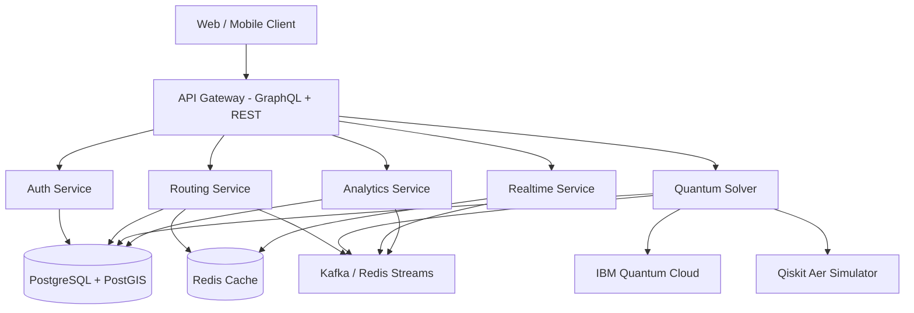
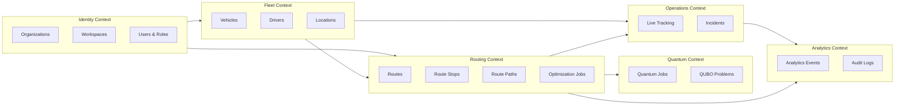
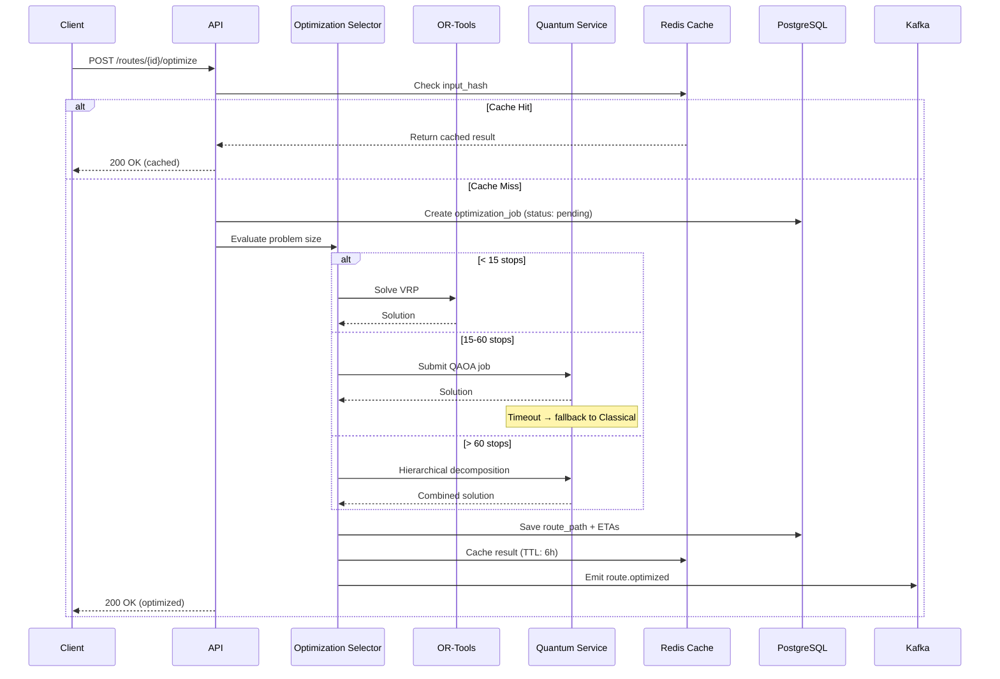

# 📄 BACKEND_STRUCTURE.md

**Product:** OmniRoute AI
**Database:** PostgreSQL 17 + PostGIS 3.5
**Architecture:** Hybrid Microservices + Event-Driven (CQRS for analytics)
**Last Updated:** 2026-02-27

---

# 1. Backend Architecture Overview



---

# 2. Domain-Driven Design — Bounded Contexts



---

# 3. Database Design Principles

1. **Multi-tenant first** — all tables scoped by `workspace_id`
2. **Geo-native storage** — PostGIS for all spatial data
3. **Industry-agnostic core** — mode-specific data in JSONB `metadata` fields
4. **Event sourced analytics** — every significant action creates an event
5. **Soft deletes** — `deleted_at TIMESTAMP` on mutable entities
6. **Audit trail** — all mutations logged with user, timestamp, and diff
7. **UUID primary keys** — no sequential IDs (security + distribution)
8. **Row-Level Security (RLS)** — PostgreSQL-native tenant isolation

---

# 4. DATABASE SCHEMA

---

## 4.1 organizations

```sql
CREATE TABLE organizations (
  id UUID PRIMARY KEY DEFAULT gen_random_uuid(),
  name TEXT NOT NULL,
  slug TEXT UNIQUE NOT NULL,
  industry_default TEXT NOT NULL DEFAULT 'logistics',
  plan TEXT NOT NULL DEFAULT 'free' CHECK (plan IN ('free', 'pro', 'enterprise')),
  settings JSONB NOT NULL DEFAULT '{}',
  created_at TIMESTAMPTZ NOT NULL DEFAULT NOW(),
  updated_at TIMESTAMPTZ NOT NULL DEFAULT NOW(),
  deleted_at TIMESTAMPTZ
);

CREATE INDEX idx_organizations_slug ON organizations(slug) WHERE deleted_at IS NULL;
```

---

## 4.2 workspaces (multi-tenant isolation boundary)

```sql
CREATE TABLE workspaces (
  id UUID PRIMARY KEY DEFAULT gen_random_uuid(),
  organization_id UUID NOT NULL REFERENCES organizations(id) ON DELETE CASCADE,
  name TEXT NOT NULL,
  region TEXT NOT NULL,
  settings JSONB NOT NULL DEFAULT '{}',
  active_mode TEXT NOT NULL DEFAULT 'logistics'
    CHECK (active_mode IN ('logistics', 'food', 'agriculture', 'smartcity', 'emergency', 'driver')),
  created_at TIMESTAMPTZ NOT NULL DEFAULT NOW(),
  updated_at TIMESTAMPTZ NOT NULL DEFAULT NOW(),
  deleted_at TIMESTAMPTZ
);

CREATE INDEX idx_workspaces_org ON workspaces(organization_id) WHERE deleted_at IS NULL;
```

---

## 4.3 users

```sql
CREATE TYPE user_role AS ENUM ('admin', 'operator', 'analyst', 'driver', 'responder', 'viewer');
CREATE TYPE user_status AS ENUM ('active', 'inactive', 'suspended', 'pending_verification');

CREATE TABLE users (
  id UUID PRIMARY KEY DEFAULT gen_random_uuid(),
  workspace_id UUID NOT NULL REFERENCES workspaces(id) ON DELETE CASCADE,
  email TEXT NOT NULL,
  password_hash TEXT NOT NULL,
  full_name TEXT NOT NULL,
  role user_role NOT NULL DEFAULT 'viewer',
  status user_status NOT NULL DEFAULT 'pending_verification',
  last_login_at TIMESTAMPTZ,
  created_at TIMESTAMPTZ NOT NULL DEFAULT NOW(),
  updated_at TIMESTAMPTZ NOT NULL DEFAULT NOW(),
  deleted_at TIMESTAMPTZ,

  CONSTRAINT unique_email_per_workspace UNIQUE (workspace_id, email)
);

CREATE INDEX idx_users_workspace ON users(workspace_id) WHERE deleted_at IS NULL;
CREATE INDEX idx_users_email ON users(email) WHERE deleted_at IS NULL;
```

---

## 4.4 vehicles

```sql
CREATE TYPE vehicle_status AS ENUM ('available', 'in_transit', 'maintenance', 'offline');

CREATE TABLE vehicles (
  id UUID PRIMARY KEY DEFAULT gen_random_uuid(),
  workspace_id UUID NOT NULL REFERENCES workspaces(id) ON DELETE CASCADE,
  vehicle_type TEXT NOT NULL,
  capacity_kg INT NOT NULL DEFAULT 0,
  capacity_volume_m3 FLOAT,
  plate_number TEXT NOT NULL,
  status vehicle_status NOT NULL DEFAULT 'available',
  last_location GEOGRAPHY(Point, 4326),
  last_location_at TIMESTAMPTZ,
  fuel_type TEXT CHECK (fuel_type IN ('petrol', 'diesel', 'electric', 'hybrid', 'cng')),
  max_range_km FLOAT,
  metadata JSONB NOT NULL DEFAULT '{}',
  created_at TIMESTAMPTZ NOT NULL DEFAULT NOW(),
  updated_at TIMESTAMPTZ NOT NULL DEFAULT NOW(),
  deleted_at TIMESTAMPTZ
);

CREATE INDEX idx_vehicles_workspace ON vehicles(workspace_id) WHERE deleted_at IS NULL;
CREATE INDEX idx_vehicles_status ON vehicles(workspace_id, status) WHERE deleted_at IS NULL;
CREATE INDEX idx_vehicles_location ON vehicles USING GIST(last_location);
```

---

## 4.5 drivers

```sql
CREATE TABLE drivers (
  id UUID PRIMARY KEY DEFAULT gen_random_uuid(),
  user_id UUID NOT NULL REFERENCES users(id) ON DELETE CASCADE,
  vehicle_id UUID REFERENCES vehicles(id) ON DELETE SET NULL,
  license_number TEXT NOT NULL,
  license_expiry DATE,
  phone TEXT,
  availability BOOLEAN NOT NULL DEFAULT true,
  rating FLOAT DEFAULT 0.0 CHECK (rating >= 0 AND rating <= 5),
  total_trips INT NOT NULL DEFAULT 0,
  created_at TIMESTAMPTZ NOT NULL DEFAULT NOW(),
  updated_at TIMESTAMPTZ NOT NULL DEFAULT NOW()
);

CREATE UNIQUE INDEX idx_drivers_user ON drivers(user_id);
CREATE INDEX idx_drivers_vehicle ON drivers(vehicle_id);
CREATE INDEX idx_drivers_available ON drivers(availability) WHERE availability = true;
```

---

## 4.6 locations (universal geo storage)

```sql
CREATE TYPE location_type AS ENUM (
  'warehouse', 'farm', 'restaurant', 'hospital', 'checkpoint',
  'depot', 'customer', 'market', 'station', 'custom'
);

CREATE TABLE locations (
  id UUID PRIMARY KEY DEFAULT gen_random_uuid(),
  workspace_id UUID NOT NULL REFERENCES workspaces(id) ON DELETE CASCADE,
  name TEXT NOT NULL,
  address TEXT,
  geo GEOGRAPHY(Point, 4326) NOT NULL,
  location_type location_type NOT NULL DEFAULT 'custom',
  contact_info JSONB DEFAULT '{}',
  operating_hours JSONB DEFAULT '{}',
  metadata JSONB NOT NULL DEFAULT '{}',
  created_at TIMESTAMPTZ NOT NULL DEFAULT NOW(),
  updated_at TIMESTAMPTZ NOT NULL DEFAULT NOW(),
  deleted_at TIMESTAMPTZ
);

CREATE INDEX idx_locations_workspace ON locations(workspace_id) WHERE deleted_at IS NULL;
CREATE INDEX idx_locations_geo ON locations USING GIST(geo);
CREATE INDEX idx_locations_type ON locations(workspace_id, location_type) WHERE deleted_at IS NULL;
```

---

## 4.7 routes

```sql
CREATE TYPE route_status AS ENUM ('draft', 'optimizing', 'optimized', 'deployed', 'in_progress', 'completed', 'cancelled');
CREATE TYPE optimization_mode AS ENUM ('classical', 'hybrid', 'quantum');

CREATE TABLE routes (
  id UUID PRIMARY KEY DEFAULT gen_random_uuid(),
  workspace_id UUID NOT NULL REFERENCES workspaces(id) ON DELETE CASCADE,
  vehicle_id UUID REFERENCES vehicles(id) ON DELETE SET NULL,
  name TEXT,
  optimization_mode optimization_mode NOT NULL DEFAULT 'classical',
  status route_status NOT NULL DEFAULT 'draft',
  distance_km FLOAT,
  estimated_duration_minutes INT,
  actual_duration_minutes INT,
  optimization_score FLOAT CHECK (optimization_score >= 0 AND optimization_score <= 100),
  constraints JSONB NOT NULL DEFAULT '{}',
  created_by UUID NOT NULL REFERENCES users(id),
  started_at TIMESTAMPTZ,
  completed_at TIMESTAMPTZ,
  created_at TIMESTAMPTZ NOT NULL DEFAULT NOW(),
  updated_at TIMESTAMPTZ NOT NULL DEFAULT NOW(),
  deleted_at TIMESTAMPTZ
);

CREATE INDEX idx_routes_workspace ON routes(workspace_id) WHERE deleted_at IS NULL;
CREATE INDEX idx_routes_status ON routes(workspace_id, status) WHERE deleted_at IS NULL;
CREATE INDEX idx_routes_vehicle ON routes(vehicle_id) WHERE deleted_at IS NULL;
CREATE INDEX idx_routes_created ON routes(workspace_id, created_at DESC) WHERE deleted_at IS NULL;
```

---

## 4.8 route_stops

```sql
CREATE TABLE route_stops (
  id UUID PRIMARY KEY DEFAULT gen_random_uuid(),
  route_id UUID NOT NULL REFERENCES routes(id) ON DELETE CASCADE,
  location_id UUID NOT NULL REFERENCES locations(id),
  stop_order INT NOT NULL,
  arrival_eta TIMESTAMPTZ,
  departure_eta TIMESTAMPTZ,
  actual_arrival TIMESTAMPTZ,
  service_time_minutes INT DEFAULT 0,
  load_kg FLOAT DEFAULT 0,
  completed BOOLEAN NOT NULL DEFAULT false,
  completed_at TIMESTAMPTZ,
  notes TEXT,

  CONSTRAINT unique_stop_order UNIQUE (route_id, stop_order)
);

CREATE INDEX idx_route_stops_route ON route_stops(route_id);
```

---

## 4.9 route_paths (PostGIS LineString)

```sql
CREATE TABLE route_paths (
  id UUID PRIMARY KEY DEFAULT gen_random_uuid(),
  route_id UUID NOT NULL REFERENCES routes(id) ON DELETE CASCADE,
  path GEOGRAPHY(LineString, 4326) NOT NULL,
  segment_index INT NOT NULL DEFAULT 0,
  distance_km FLOAT,
  created_at TIMESTAMPTZ NOT NULL DEFAULT NOW()
);

CREATE INDEX idx_route_paths_route ON route_paths(route_id);
CREATE INDEX idx_route_paths_geo ON route_paths USING GIST(path);
```

---

## 4.10 optimization_jobs

```sql
CREATE TYPE solver_type AS ENUM ('classical', 'hybrid', 'quantum');
CREATE TYPE job_status AS ENUM ('pending', 'running', 'completed', 'failed', 'timeout', 'cancelled');

CREATE TABLE optimization_jobs (
  id UUID PRIMARY KEY DEFAULT gen_random_uuid(),
  route_id UUID REFERENCES routes(id) ON DELETE SET NULL,
  workspace_id UUID NOT NULL REFERENCES workspaces(id),
  solver_type solver_type NOT NULL,
  status job_status NOT NULL DEFAULT 'pending',
  input_hash TEXT NOT NULL,
  input_data JSONB NOT NULL,
  result_data JSONB,
  solution_quality_score FLOAT,
  execution_time_ms INT,
  error_message TEXT,
  retry_count INT NOT NULL DEFAULT 0,
  created_at TIMESTAMPTZ NOT NULL DEFAULT NOW(),
  started_at TIMESTAMPTZ,
  completed_at TIMESTAMPTZ
);

CREATE INDEX idx_opt_jobs_route ON optimization_jobs(route_id);
CREATE INDEX idx_opt_jobs_status ON optimization_jobs(workspace_id, status);
CREATE INDEX idx_opt_jobs_hash ON optimization_jobs(input_hash);
```

---

## 4.11 quantum_jobs

```sql
CREATE TABLE quantum_jobs (
  id UUID PRIMARY KEY DEFAULT gen_random_uuid(),
  optimization_job_id UUID NOT NULL REFERENCES optimization_jobs(id) ON DELETE CASCADE,
  backend TEXT NOT NULL DEFAULT 'aer_simulator',
  qubits_used INT NOT NULL,
  circuit_depth INT NOT NULL,
  qaoa_layers INT NOT NULL DEFAULT 1,
  classical_optimizer TEXT NOT NULL DEFAULT 'COBYLA',
  result_energy FLOAT,
  result_bitstring TEXT,
  status job_status NOT NULL DEFAULT 'pending',
  ibm_job_id TEXT,
  raw_result JSONB,
  execution_time_ms INT,
  created_at TIMESTAMPTZ NOT NULL DEFAULT NOW(),
  completed_at TIMESTAMPTZ
);

CREATE INDEX idx_quantum_jobs_opt ON quantum_jobs(optimization_job_id);
CREATE INDEX idx_quantum_jobs_status ON quantum_jobs(status);
```

---

## 4.12 live_vehicle_positions (time-series, partitioned)

```sql
CREATE TABLE live_vehicle_positions (
  vehicle_id UUID NOT NULL REFERENCES vehicles(id) ON DELETE CASCADE,
  position GEOGRAPHY(Point, 4326) NOT NULL,
  speed_kmh FLOAT,
  heading FLOAT,
  accuracy_m FLOAT,
  battery_pct FLOAT,
  recorded_at TIMESTAMPTZ NOT NULL DEFAULT NOW()
) PARTITION BY RANGE (recorded_at);

-- Create monthly partitions (automate via pg_partman or cron)
CREATE TABLE live_vehicle_positions_2026_03
  PARTITION OF live_vehicle_positions
  FOR VALUES FROM ('2026-03-01') TO ('2026-04-01');

CREATE INDEX idx_live_pos_vehicle ON live_vehicle_positions(vehicle_id, recorded_at DESC);
CREATE INDEX idx_live_pos_geo ON live_vehicle_positions USING GIST(position);
```

**Data retention:** Partition older than 30 days → archive to S3. Older than 90 days → delete.

---

## 4.13 incidents (Emergency Mode)

```sql
CREATE TYPE incident_severity AS ENUM ('critical', 'high', 'medium', 'low');
CREATE TYPE incident_status AS ENUM ('reported', 'dispatched', 'in_progress', 'resolved', 'closed');

CREATE TABLE incidents (
  id UUID PRIMARY KEY DEFAULT gen_random_uuid(),
  workspace_id UUID NOT NULL REFERENCES workspaces(id),
  severity incident_severity NOT NULL,
  incident_type TEXT NOT NULL,
  description TEXT,
  location GEOGRAPHY(Point, 4326) NOT NULL,
  status incident_status NOT NULL DEFAULT 'reported',
  response_sla_minutes INT,
  assigned_vehicles UUID[] DEFAULT '{}',
  reported_by UUID REFERENCES users(id),
  resolved_at TIMESTAMPTZ,
  created_at TIMESTAMPTZ NOT NULL DEFAULT NOW(),
  updated_at TIMESTAMPTZ NOT NULL DEFAULT NOW()
);

CREATE INDEX idx_incidents_workspace ON incidents(workspace_id, status);
CREATE INDEX idx_incidents_severity ON incidents(workspace_id, severity) WHERE status != 'closed';
CREATE INDEX idx_incidents_location ON incidents USING GIST(location);
```

---

## 4.14 analytics_events (event sourcing)

```sql
CREATE TABLE analytics_events (
  id UUID PRIMARY KEY DEFAULT gen_random_uuid(),
  workspace_id UUID NOT NULL,
  event_type TEXT NOT NULL,
  entity_type TEXT NOT NULL,
  entity_id UUID,
  actor_id UUID,
  payload JSONB NOT NULL DEFAULT '{}',
  created_at TIMESTAMPTZ NOT NULL DEFAULT NOW()
) PARTITION BY RANGE (created_at);

CREATE INDEX idx_analytics_workspace ON analytics_events(workspace_id, event_type, created_at DESC);
```

---

## 4.15 audit_logs

```sql
CREATE TABLE audit_logs (
  id UUID PRIMARY KEY DEFAULT gen_random_uuid(),
  workspace_id UUID NOT NULL,
  user_id UUID NOT NULL,
  action TEXT NOT NULL,
  resource_type TEXT NOT NULL,
  resource_id UUID,
  changes JSONB,
  ip_address INET,
  user_agent TEXT,
  created_at TIMESTAMPTZ NOT NULL DEFAULT NOW()
);

CREATE INDEX idx_audit_workspace ON audit_logs(workspace_id, created_at DESC);
CREATE INDEX idx_audit_user ON audit_logs(user_id, created_at DESC);
CREATE INDEX idx_audit_resource ON audit_logs(resource_type, resource_id);
```

---

## 4.16 Row-Level Security (RLS)

Enable on all tenant-scoped tables:

```sql
-- Example for routes table (apply same pattern to all workspace-scoped tables)
ALTER TABLE routes ENABLE ROW LEVEL SECURITY;

CREATE POLICY workspace_isolation ON routes
  FOR ALL
  USING (workspace_id = current_setting('app.current_workspace_id')::UUID);

-- Set context in middleware before each request:
-- SET LOCAL app.current_workspace_id = '<workspace_uuid>';
```

> Apply this pattern to: `vehicles`, `routes`, `locations`, `incidents`, `optimization_jobs`, `analytics_events`, `audit_logs`.

---

# 5. API STRUCTURE

## Base URL

```
/api/v1
```

## Versioning Strategy

- URL-based versioning: `/api/v1/`, `/api/v2/`
- Breaking changes → new version
- Non-breaking additions → same version
- Deprecation notice 3 months before removal

---

## Standardized Response Format

### Success

```json
{
  "success": true,
  "data": { ... },
  "meta": {
    "request_id": "550e8400-e29b-41d4-a716-446655440000",
    "timestamp": "2026-03-01T12:00:00Z",
    "pagination": { "page": 1, "per_page": 20, "total": 142 }
  }
}
```

### Error

```json
{
  "success": false,
  "error": {
    "code": "ROUTE_NOT_FOUND",
    "message": "Route with ID xyz does not exist",
    "details": { "route_id": "xyz" }
  },
  "meta": { "request_id": "..." }
}
```

### Error Codes

| Code | HTTP | Description |
| --- | --- | --- |
| VALIDATION_ERROR | 422 | Request body validation failed |
| NOT_FOUND | 404 | Resource not found |
| UNAUTHORIZED | 401 | Missing or invalid token |
| FORBIDDEN | 403 | Insufficient permissions |
| CONFLICT | 409 | Resource already exists |
| RATE_LIMITED | 429 | Too many requests |
| OPTIMIZATION_FAILED | 500 | Solver failed (fallback attempted) |
| QUANTUM_TIMEOUT | 504 | Quantum job exceeded timeout |

---

# 6. AUTH SERVICE

| Method | Endpoint | Description | Auth |
| --- | --- | --- | --- |
| POST | `/auth/register` | Create account | None |
| POST | `/auth/login` | Get access + refresh tokens | None |
| POST | `/auth/refresh` | Refresh access token | Refresh token |
| POST | `/auth/logout` | Invalidate refresh token | Access token |
| GET | `/auth/me` | Get current user profile | Access token |
| PATCH | `/auth/me` | Update profile | Access token |

---

# 7. WORKSPACE API

| Method | Endpoint | Description | Role |
| --- | --- | --- | --- |
| GET | `/workspaces` | List user's workspaces | Any |
| POST | `/workspaces` | Create workspace | Admin |
| GET | `/workspaces/{id}` | Get workspace details | Any |
| PATCH | `/workspaces/{id}` | Update workspace | Admin |
| DELETE | `/workspaces/{id}` | Soft-delete workspace | Admin |
| GET | `/workspaces/{id}/members` | List workspace members | Admin/Operator |
| POST | `/workspaces/{id}/members` | Invite member | Admin |

---

# 8. VEHICLE API

| Method | Endpoint | Description | Role |
| --- | --- | --- | --- |
| GET | `/vehicles` | List vehicles (paginated) | Operator+ |
| POST | `/vehicles` | Create vehicle | Admin/Operator |
| GET | `/vehicles/{id}` | Get vehicle details | Operator+ |
| PATCH | `/vehicles/{id}` | Update vehicle | Admin/Operator |
| DELETE | `/vehicles/{id}` | Soft-delete vehicle | Admin |
| GET | `/vehicles/{id}/live` | Get current position | Operator+ |
| GET | `/vehicles/{id}/history` | Position history (time range) | Analyst+ |
| GET | `/vehicles/nearby` | Find vehicles near a point | Operator+ |

---

# 9. ROUTING API

| Method | Endpoint | Description | Role |
| --- | --- | --- | --- |
| POST | `/routes` | Create route (draft) | Operator+ |
| POST | `/routes/{id}/optimize` | Trigger optimization | Operator+ |
| GET | `/routes/{id}` | Get route with stops + path | Any |
| GET | `/routes` | List routes (paginated, filtered) | Any |
| PATCH | `/routes/{id}` | Update route | Operator+ |
| POST | `/routes/{id}/deploy` | Deploy to vehicle | Operator+ |
| POST | `/routes/{id}/complete` | Mark as completed | Driver |
| DELETE | `/routes/{id}` | Soft-delete route | Admin |

### POST `/routes` — Request Body

```json
{
  "name": "Morning Delivery Run",
  "vehicle_id": "uuid",
  "stops": [
    { "location_id": "uuid", "load_kg": 50, "service_time_minutes": 10 },
    { "location_id": "uuid", "load_kg": 30, "service_time_minutes": 5 }
  ],
  "constraints": {
    "max_distance_km": 200,
    "time_window_start": "08:00",
    "time_window_end": "18:00",
    "optimize_for": "distance"
  }
}
```

---

# 10. QUANTUM SERVICE API

| Method | Endpoint | Description | Role |
| --- | --- | --- | --- |
| POST | `/quantum/optimize` | Submit quantum optimization job | Operator+ |
| GET | `/quantum/job/{id}` | Get job status + result | Any |
| GET | `/quantum/jobs` | List recent jobs | Analyst+ |
| POST | `/quantum/simulate` | Run simulation (smart city) | Analyst+ |
| GET | `/quantum/health` | Service + simulator health | Any |

---

# 11. LIVE TRACKING API

| Method | Endpoint | Description | Role |
| --- | --- | --- | --- |
| POST | `/tracking/update` | Driver sends GPS position | Driver |
| GET | `/tracking/vehicle/{id}` | Get latest position | Operator+ |
| WS | `/ws/tracking` | Real-time position stream | Operator+ |
| GET | `/tracking/deviations` | Active route deviations | Operator+ |

### WebSocket Protocol

```json
// Client → Server (driver GPS update)
{ "type": "position_update", "vehicle_id": "uuid", "lat": 12.97, "lng": 77.59, "speed": 45.2, "heading": 180 }

// Server → Client (broadcast to dashboard subscribers)
{ "type": "vehicle_moved", "vehicle_id": "uuid", "position": [77.59, 12.97], "speed": 45.2 }

// Server → Client (alert)
{ "type": "route_deviation", "vehicle_id": "uuid", "distance_from_route_m": 750, "severity": "warning" }
```

---

# 12. INCIDENT API (Emergency Mode)

| Method | Endpoint | Description | Role |
| --- | --- | --- | --- |
| POST | `/incidents` | Create incident | Responder+ |
| GET | `/incidents` | List active incidents | Responder+ |
| GET | `/incidents/{id}` | Get incident details | Responder+ |
| PATCH | `/incidents/{id}` | Update status/severity | Responder+ |
| POST | `/incidents/{id}/dispatch` | Auto-route closest responders | Operator+ |

---

# 13. EXPERIENCE API

| Method | Endpoint | Description | Role |
| --- | --- | --- | --- |
| GET | `/experience/{mode}` | Get experience configuration | Any |
| GET | `/experience/modes` | List available modes | Any |

---

# 14. ANALYTICS API

| Method | Endpoint | Description | Role |
| --- | --- | --- | --- |
| GET | `/analytics/routes` | Route performance metrics | Analyst+ |
| GET | `/analytics/fleet` | Fleet utilization stats | Analyst+ |
| GET | `/analytics/efficiency` | Optimization savings report | Analyst+ |
| GET | `/analytics/quantum` | Quantum vs. classical comparison | Analyst+ |

> Analytics uses **CQRS read models** — materialized views updated asynchronously from events, not queried from live tables.

---

# 15. EVENT SYSTEM

### Kafka / Redis Streams Topics

| Topic | Producer | Consumers |
| --- | --- | --- |
| `route.created` | Routing Service | Analytics |
| `route.optimized` | Routing Service | Analytics, Notification |
| `route.deployed` | Routing Service | Realtime, Analytics |
| `vehicle.position_updated` | Realtime Service | Dashboard, Analytics |
| `vehicle.route_deviated` | Realtime Service | Notification, Analytics |
| `incident.created` | Incident Service | Routing, Notification |
| `incident.dispatched` | Incident Service | Realtime, Analytics |
| `quantum.job_completed` | Quantum Service | Routing, Analytics |
| `quantum.job_failed` | Quantum Service | Routing, Notification |
| `user.login` | Auth Service | Audit, Analytics |

### Event Schema (standard envelope)

```json
{
  "event_id": "uuid",
  "event_type": "route.optimized",
  "workspace_id": "uuid",
  "actor_id": "uuid",
  "timestamp": "ISO-8601",
  "data": { ... },
  "version": 1
}
```

---

# 16. Optimization Flow (Full Backend Path)



---

# 17. Database Migration Strategy

**Tool:** Alembic (with async SQLAlchemy)

```bash
# Create migration
alembic revision --autogenerate -m "add_vehicle_fuel_type"

# Apply migrations
alembic upgrade head

# Rollback one step
alembic downgrade -1

# Check current version
alembic current
```

**Rules:**

1. Every schema change = Alembic migration (never raw SQL in production)
2. Migrations must be reversible (`downgrade` function required)
3. No data-destructive migrations without backup verification
4. Run migrations in CI before deploy
5. Large table migrations use `CREATE INDEX CONCURRENTLY`

---

# 18. Performance Strategy

| Strategy | Implementation |
| --- | --- |
| Spatial indexing | GiST indexes on all GEOGRAPHY columns |
| Route caching | Redis, keyed on input_hash, TTL 6 hours |
| Async quantum jobs | ARQ workers, non-blocking API responses |
| Connection pooling | PgBouncer (transaction mode), max 20/service |
| Query optimization | `EXPLAIN ANALYZE` on all frequent queries |
| Read replicas | PostgreSQL streaming replication for analytics |
| Partitioning | `live_vehicle_positions` monthly partitions |
| Materialized views | Pre-computed analytics aggregations |

---

# 19. Scaling Strategy

| Layer | Scaling Approach | Tool |
| --- | --- | --- |
| API | Horizontal pod autoscaling | Kubernetes HPA |
| Database | Read replicas + connection pooling | PgBouncer + streaming replication |
| Tracking | Event streaming | Kafka / Redis Streams |
| Quantum | Worker queue with concurrency limit | ARQ + Redis |
| Cache | Redis Cluster | Redis Sentinel/Cluster |
| Frontend | Edge CDN | Cloudflare / Vercel |

---

# 20. Security

| Layer | Mechanism |
| --- | --- |
| Tenant isolation | Row-Level Security (RLS) on PostgreSQL |
| Transport | TLS 1.3, HSTS headers |
| Authentication | JWT (RS256 in production, HS256 for dev) |
| Authorization | Role-based + workspace-scoped middleware |
| GPS data | Encrypted at rest (column-level encryption for PII) |
| API protection | Rate limiting (100 req/min/user, 1000 req/min/workspace) |
| Secrets | HashiCorp Vault or K8s Secrets |
| Audit | All mutations logged with actor + timestamp |
| SQL injection | Parameterized queries only (SQLAlchemy) |
| Input validation | Pydantic models on all endpoints |

---

# 21. Health Check Endpoints

Every service exposes:

| Endpoint | Purpose | Checks |
| --- | --- | --- |
| `GET /health` | Liveness | Process alive |
| `GET /health/ready` | Readiness | DB + Redis + Kafka connected |
| `GET /health/startup` | Startup | Migrations applied, config valid |

---

# ✅ Backend Status

This backend architecture supports:

- ✔ Multi-tenant workspace isolation with RLS
- ✔ Quantum optimization job tracking with async execution
- ✔ Real-time fleet tracking with time-series partitioning
- ✔ Emergency incident management with SLA tracking
- ✔ Event-driven analytics with CQRS read models
- ✔ Enterprise scalability with horizontal scaling patterns
- ✔ Full audit trail and security compliance
- ✔ Database migrations with Alembic
