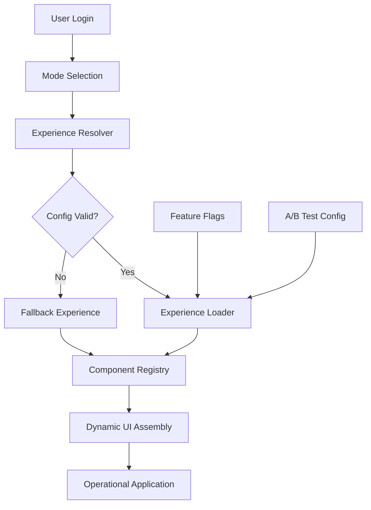
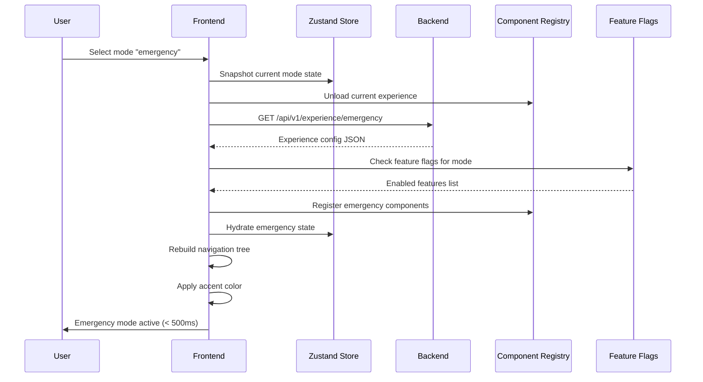
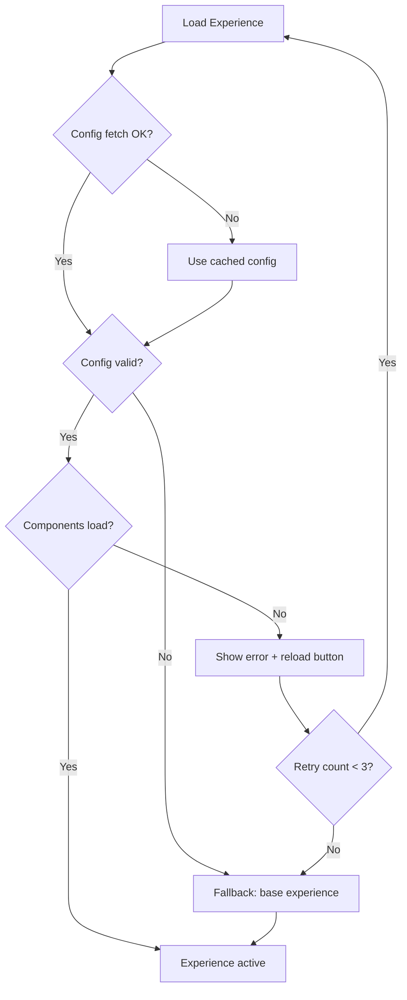

# 📄 EXPERIENCE_ENGINE.md

**Product:** OmniRoute AI
**Subsystem:** Experience Engine (Morphing Platform Core)
**Status:** Architecture Locked
**Last Updated:** 2026-02-27

---

# 1. Purpose

The Experience Engine enables OmniRoute AI to behave as:

- Logistics Platform
- Food Delivery System
- Agriculture Planner
- Smart City Control Center
- Emergency Response System
- Driver Assistant App

—all from a **single codebase and backend**.

---

## Core Idea

```
Traditional apps:    One Backend → One Product Experience
OmniRoute:           One Backend → Many Dynamic Experiences
```

The Experience Engine dynamically loads layouts, navigation, workflows, dashboards, terminology, and optimization weights based on the selected **Mode**.

This is NOT theming. This is **product behavior transformation**.

---

# 2. High-Level Architecture



---

# 3. Key Concepts

## 3.1 Experience

An **Experience** = fully defined product configuration.

It defines:

| Layer | What Changes | Authority |
| --- | --- | --- |
| Optimization Binding | References a backend-defined Optimization Profile ID | Backend owns logic |
| UI Structure | Layout type, dashboard widgets, panels | Frontend |
| Data Views | Which entities are visible, how they're labeled | Frontend |
| Backend Capability Scope | Allowed API scopes and endpoints per experience | Backend enforced |
| Permissions | What each role can see and do | Backend enforced |
| Workflows | Step-by-step user journeys | Frontend |
| Terminology | Lexical relabeling only (no semantic alteration) | Frontend |

> **Architectural Rule:** Experiences express *intent*. They do NOT define domain logic.
> An experience references backend-defined profiles — it never mutates solver behavior, optimization weights, or constraint rules directly.

---

## 3.2 Mode

A Mode activates one Experience:

```typescript
type Mode = 'logistics' | 'food' | 'agriculture' | 'smartcity' | 'emergency' | 'driver';
```

---

## 3.3 Experience Package

Stored at:

```
/experiences/{mode}/
```

Structure:

```
logistics/
 ├── config.json              # Mode definition (validated against schema)
 ├── dependencies.json        # Dependency manifest (shared widgets, libs)
 ├── migrations/              # State migration hooks per version
 │   └── v1.2-to-v1.3.ts
 ├── navigation.ts            # Sidebar items + routes
 ├── dictionary.json          # Terminology mapping (lexical only)
 ├── permissions.ts           # Role-based feature access
 ├── capability-scope.ts      # Allowed backend API scopes
 ├── dashboards/
 │   ├── FleetDashboard.tsx   # Main dashboard
 │   └── widgets/             # Dashboard widget components
 ├── workflows/
 │   ├── route-creation.json  # Step definitions
 │   └── fleet-setup.json
 ├── components/
 │   ├── FleetMap.tsx         # Mode-specific map component
 │   └── RouteCard.tsx
 └── __tests__/               # Mode-specific tests
     ├── config.test.ts
     └── navigation.test.ts
```

> **Removed:** `optimization.ts` — optimization profiles are now defined and owned server-side.
> **Added:** `capability-scope.ts`, `dependencies.json`, `migrations/` — see sections below.

---

# 4. Experience Lifecycle



---

## Step 1 — Mode Selection

User selects mode at `/select-mode` or via `⌘M` shortcut.

System saves `active_mode` in:
- Zustand store (client)
- User preferences API (server)
- URL path prefix (deep link)

---

## Step 2 — Experience Resolution

Frontend requests:

```
GET /api/v1/experience/{mode}
```

Backend returns validated configuration.

---

## Step 3 — Experience Boot

Engine performs (in order):

1. Snapshot current mode state (for fast switch-back)
2. Unload current component registry
3. Load new experience modules (code-split, lazy loaded)
4. Check feature flags for new mode
5. Hydrate state from server or cached snapshot
6. Rebuild navigation tree
7. Apply accent color + terminology
8. Announce mode change to screen reader (`aria-live`)
9. Focus on main heading

**No full page reload. No flash of unstyled content.**

---

# 5. Experience Configuration Schema

## JSON Schema (validated at build time + runtime)

```typescript
interface ExperienceConfig {
  mode: Mode;
  version: string;                    // Semantic versioning
  layout: LayoutType;
  defaultDashboard: string;
  navigation: string;                 // Reference to navigation.ts export
  optimizationProfileId: string;      // Reference to backend-defined profile (NOT weights)
  capabilityScope: string[];          // Allowed backend API scopes
  accentColor: string;                // CSS hex value
  features: string[];                 // Feature keys (checked against registry)
  featureFlags?: Record<string, boolean>; // Override defaults
  dependencies?: DependencyManifest;  // Shared widget/lib version requirements
  metadata?: Record<string, unknown>;
}

// Experiences reference profiles by ID — they never define weights or solver config
// Backend resolves the profile and applies domain logic independently
type OptimizationProfileId = string; // e.g. 'priority_fastest', 'cost_efficient'
```

## Example: Emergency Mode

```json
{
  "mode": "emergency",
  "version": "1.2.0",
  "layout": "command-center",
  "defaultDashboard": "incident_overview",
  "navigation": "emergency_nav",
  "optimizationProfileId": "priority_fastest",
  "capabilityScope": [
    "incidents:read",
    "incidents:write",
    "dispatch:execute",
    "routes:optimize",
    "tracking:realtime",
    "evacuation:plan",
    "hospitals:read"
  ],
  "accentColor": "#DC2626",
  "features": [
    "incident_dispatch",
    "priority_routing",
    "live_tracking",
    "evacuation_planner",
    "hospital_proximity"
  ],
  "featureFlags": {
    "quantum_optimization": true,
    "ai_severity_detection": false
  },
  "dependencies": {
    "shared-analytics-widget": "^2.0.0",
    "map-overlays": "^1.5.0"
  }
}
```

## Build-Time Validation

```typescript
// At build time: validate all config.json files against schema
// Invalid config → build fails with descriptive error
// Missing required field → build fails
// Unknown feature key → warning (not error, for forward compat)
```

---

# 6. Component Registry (Critical System — Version-Scoped)

All UI components are registered dynamically via lazy loading.

> **Architectural Invariant:** Registry instances are **immutable after activation**.
> Mode switch creates a **new registry instance**. Hot mutation of an active registry is forbidden.
> Old registry is destroyed only after the new one is fully ready (atomic swap).

## Registry Interface

```typescript
type ComponentLoader = () => Promise<{ default: React.ComponentType<any> }>;

// Each registry instance is version-scoped and immutable after seal()
class ComponentRegistry {
  private registry = new Map<string, ComponentLoader>();
  private loaded = new Map<string, React.ComponentType<any>>();
  private sealed = false;

  readonly experienceVersion: string;  // Bound to specific experience version

  constructor(experienceVersion: string) {
    this.experienceVersion = experienceVersion;
  }

  register(key: string, loader: ComponentLoader): void {
    if (this.sealed) {
      throw new Error(
        `Registry v${this.experienceVersion} is sealed. Cannot register '${key}'.`
      );
    }
    this.registry.set(key, loader);
  }

  // Freeze the registry — no further mutations allowed
  seal(): void {
    this.sealed = true;
    Object.freeze(this.registry);
  }

  get(key: string): Promise<React.ComponentType<any>>;
  has(key: string): boolean;
  getLoadedKeys(): string[];

  // No unloadAll() — registries are disposable, not mutable
  // Garbage collection handles cleanup after atomic swap
}

// Factory: creates version-scoped registry instances
class RegistryManager {
  private active: ComponentRegistry | null = null;
  private pending: ComponentRegistry | null = null;

  // Create new registry for incoming experience (does NOT affect active)
  createPending(experienceVersion: string): ComponentRegistry {
    this.pending = new ComponentRegistry(experienceVersion);
    return this.pending;
  }

  // Atomic swap: pending becomes active, old active is discarded
  activate(): void {
    if (!this.pending) throw new Error('No pending registry to activate');
    this.pending.seal();
    const old = this.active;
    this.active = this.pending;
    this.pending = null;
    // old registry becomes eligible for GC — no dangling references
  }

  // Rollback: discard pending if boot fails
  discardPending(): void {
    this.pending = null;
  }

  getActive(): ComponentRegistry {
    if (!this.active) throw new Error('No active registry');
    return this.active;
  }
}
```

## Registration Pattern

```typescript
// Each experience registers its components into a PENDING registry
// logistics/index.ts
export function registerComponents(registry: ComponentRegistry) {
  registry.register('FleetMap', () => import('./components/FleetMap'));
  registry.register('FleetDashboard', () => import('./dashboards/FleetDashboard'));
  registry.register('RouteCard', () => import('./components/RouteCard'));
}

// emergency/index.ts
export function registerComponents(registry: ComponentRegistry) {
  registry.register('IncidentMap', () => import('./components/IncidentMap'));
  registry.register('IncidentDashboard', () => import('./dashboards/IncidentDashboard'));
  registry.register('DispatchPanel', () => import('./components/DispatchPanel'));
}

// Mode switch lifecycle:
// 1. registryManager.createPending('1.2.0')
// 2. registerComponents(pendingRegistry)
// 3. registryManager.activate()  ← atomic swap, old registry discarded
// If step 2 fails → registryManager.discardPending()
```

## Rendering Components by Key

```tsx
// The renderer resolves components from the ACTIVE registry
function DynamicWidget({ componentKey, props }: { componentKey: string; props: any }) {
  const Component = useRegistryComponent(componentKey);
  if (!Component) return <WidgetSkeleton />;
  return (
    <ErrorBoundary fallback={<WidgetError />}>
      <Suspense fallback={<WidgetSkeleton />}>
        <Component {...props} />
      </Suspense>
    </ErrorBoundary>
  );
}
```

> **Race condition prevention:** Because the pending registry is separate from the active one,
> a late-finishing async component load cannot pollute the active experience.
> If a background load finishes after a mode switch, it writes to a discarded pending registry — harmless.

---

# 7. Dynamic Layout Engine

Layout determined by `config.layout`:

| Layout Type | Structure | Used By |
| --- | --- | --- |
| `command-center` | Full map + sidebar panels + alert feed | Emergency |
| `fleet-dashboard` | Map (60%) + stats cards + activity feed | Logistics |
| `operations-board` | Split view: orders list + map + dispatch | Food Delivery |
| `geo-analysis` | Full map + data overlays + simulation controls | Smart City |
| `field-planner` | Map + calendar + weather overlay | Agriculture |
| `mobile-driver` | Full-screen map + bottom sheet + nav bar | Driver |

### Layout Loader

```typescript
async function loadLayout(layoutType: LayoutType): Promise<LayoutComponent> {
  const layouts: Record<LayoutType, ComponentLoader> = {
    'command-center': () => import('./layouts/CommandCenter'),
    'fleet-dashboard': () => import('./layouts/FleetDashboard'),
    'operations-board': () => import('./layouts/OperationsBoard'),
    'geo-analysis': () => import('./layouts/GeoAnalysis'),
    'field-planner': () => import('./layouts/FieldPlanner'),
    'mobile-driver': () => import('./layouts/MobileDriver'),
  };
  const module = await layouts[layoutType]();
  return module.default;
}
```

---

# 8. Navigation Generator

Navigation is NOT static. It is generated from each mode's `navigation.ts`:

```typescript
// experiences/emergency/navigation.ts
import { NavigationItem } from '@omniroute/types';

export const navigation: NavigationItem[] = [
  {
    label: 'Incidents',
    path: '/emergency/dashboard',
    icon: 'AlertTriangle',
    badge: { type: 'live-count', source: 'active_incidents' },
  },
  {
    label: 'Dispatch',
    path: '/emergency/dispatch',
    icon: 'Radio',
  },
  {
    label: 'Evacuation',
    path: '/emergency/evacuate',
    icon: 'Shield',
    requiredRole: ['admin', 'operator'],
  },
  {
    label: 'Responders',
    path: '/emergency/responders',
    icon: 'Users',
  },
  {
    label: 'Analytics',
    path: '/emergency/analytics',
    icon: 'BarChart',
    requiredRole: ['admin', 'analyst'],
  },
];
```

Sidebar rebuilt dynamically on mode switch. Items filtered by user role.

---

# 9. Workflow Engine

Workflows define multi-step user journeys as declarative configs:

```json
{
  "workflow": "incident_dispatch",
  "version": "1.0.0",
  "steps": [
    {
      "id": "create",
      "label": "Report Incident",
      "component": "IncidentForm",
      "validation": "required_fields",
      "canSkip": false
    },
    {
      "id": "analyze",
      "label": "Assess Severity",
      "component": "SeverityAnalyzer",
      "autoAdvance": true,
      "condition": "ai_severity_detection === true"
    },
    {
      "id": "optimize",
      "label": "Optimize Routes",
      "component": "RouteOptimizer",
      "async": true,
      "timeout": 30000
    },
    {
      "id": "dispatch",
      "label": "Dispatch Units",
      "component": "DispatchConfirmation",
      "requiresApproval": true
    }
  ],
  "onComplete": "redirect:/emergency/dashboard",
  "onCancel": "confirm:Are you sure? This incident will be saved as draft."
}
```

---

# 10. Optimization Profile Binding (Backend-Owned)

> **🚨 Architectural Rule:** Optimization logic lives **exclusively on the backend**.
> Experiences reference a backend-defined Optimization Profile by ID.
> They do NOT define weights, solver configs, or constraint rules directly.
>
> **Correct flow:**
> ```
> Experience → selects Optimization Profile ID
> Backend   → resolves profile rules
> Backend   → applies domain logic
> ```
>
> This ensures **system determinism**: two users viewing the same route under different
> experiences always get results governed by backend-validated logic, not frontend config.

## Backend Optimization Profiles (Server-Side)

Profiles are defined, versioned, and enforced on the backend:

```typescript
// backend/optimization/profiles.ts (SERVER-SIDE ONLY)
const OPTIMIZATION_PROFILES: Record<string, OptimizationProfile> = {
  cost_efficient: {
    id: 'cost_efficient',
    version: '1.0.0',
    weights: { distance: 0.5, time: 0.3, fuel: 0.2 },
    constraints: { maxDetourMinutes: 10, allowTrafficOverride: false },
    solver: { preferQuantum: false, timeoutMs: 30000, fallback: 'classical' },
  },
  priority_fastest: {
    id: 'priority_fastest',
    version: '1.1.0',
    weights: { distance: 0.1, time: 0.8, fuel: 0.1 },
    constraints: { maxDetourMinutes: 2, allowTrafficOverride: true, priorityLevel: 'critical' },
    solver: { preferQuantum: true, timeoutMs: 15000, fallback: 'classical' },
  },
  delivery_speed: {
    id: 'delivery_speed',
    version: '1.0.0',
    weights: { distance: 0.2, time: 0.6, fuel: 0.2 },
    constraints: { maxDetourMinutes: 5, allowTrafficOverride: false },
    solver: { preferQuantum: false, timeoutMs: 20000, fallback: 'classical' },
  },
  // ... additional profiles for agriculture, smart city, driver
};
```

## Experience → Profile Reference (Frontend)

Experience configs only contain a `profileId` — never weights or solver settings:

| Mode | Optimization Profile ID | Profile Owned By |
| --- | --- | --- |
| Logistics | `cost_efficient` | Backend |
| Food | `delivery_speed` | Backend |
| Agriculture | `batch_weather_aware` | Backend |
| Smart City | `traffic_balanced` | Backend |
| Emergency | `priority_fastest` | Backend |
| Driver | `fuel_saving` | Backend |

```typescript
// Experience config references profile by ID only
// experiences/emergency/config.json
{
  "optimizationProfileId": "priority_fastest"
}

// Backend resolves the profile and applies domain logic:
// POST /api/v1/optimize
// Body: { routes: [...], profileId: "priority_fastest" }
// Backend → looks up profile → applies weights → returns result
```

> **Audit safety:** All optimization decisions are traceable to backend-versioned profiles.
> No frontend config can alter domain logic behavior.

---

# 11. Terminology Layer (Lexical Only)

> **🚨 Architectural Constraint:** The terminology layer is **lexical only**.
> It renames display labels — it cannot imply altered domain semantics or guarantees.
>
> **Example of violation:**
> - Renaming `route` → "Response Path" could imply *medically optimized routing*
> - But the backend route may be optimized for logistics rules
> - Same entity, different implied meaning → **user trust breaks**
>
> **Rule:** Terminology may rename nouns. It must NOT imply different domain guarantees.
> Domain capability flags must match wording.

Same backend entity appears differently per mode:

| Backend Entity | Logistics | Emergency | Agriculture | Food |
| --- | --- | --- | --- | --- |
| `route` | Delivery Route | Response Path | Transport Route | Delivery Run |
| `vehicle` | Truck | Ambulance | Transport Vehicle | Rider |
| `stop` | Drop Point | Incident Node | Farm Pickup | Delivery Address |
| `location` | Warehouse | Hospital | Farm | Restaurant |
| `driver` | Driver | Responder | Transporter | Rider |

### Dictionary File

```json
// experiences/emergency/dictionary.json
{
  "_meta": {
    "constraint": "lexical_only",
    "description": "Labels are display renames. They do not alter domain behavior."
  },
  "route": "Response Path",
  "vehicle": "Ambulance",
  "stop": "Incident Node",
  "location": "Hospital",
  "driver": "Responder",
  "optimize": "Priority Route",
  "dashboard": "Command Center",
  "fleet": "Response Units"
}
```

### Semantic Safety Validation (Build-Time)

```typescript
// Build script validates that terminology does not imply unmatched capabilities
// For each dictionary entry:
//   1. Term must map to a real backend entity
//   2. Term must NOT reference a capability not present in capabilityScope
//   3. Term must NOT use guarantee-implying words (e.g. "guaranteed", "certified")
//      unless the backend capability explicitly supports it

interface TermValidationRule {
  term: string;
  requiredCapability?: string;  // Backend capability that must exist
  forbiddenImplications?: string[];  // Words that would create false guarantees
}
```

### Usage

```typescript
// Hook that resolves terms based on active mode
const t = useTerminology();
return <h1>{t('dashboard')}</h1>; // "Command Center" in emergency mode
// Note: this is a display label only — no domain behavior changes
```

---

# 12. Permission Overlay + Backend Capability Isolation

> **🚨 Architectural Rule:** Experience isolation is NOT just frontend-level.
> Each experience declares allowed backend capability scopes.
> Backend **enforces** via a policy layer — frontend hiding ≠ protection.
>
> **Risk without this:** Emergency mode could theoretically access analytics endpoints
> built for logistics assumptions. Feature exposure through API mismatch.

## Frontend Permission Overlay

Permissions are modified per experience:

```typescript
// experiences/driver/permissions.ts
export const permissions = {
  hiddenFeatures: ['analytics', 'admin_panel', 'fleet_management', 'settings'],
  readOnly: ['route_details'],
  allowedActions: ['position_update', 'route_complete', 'route_accept'],
};
```

Engine filters:
- Navigation items (hidden features don't appear in sidebar)
- API calls (unauthorized requests blocked before sending)
- Route access (redirect to dashboard if URL accessed directly)

## Backend Capability Isolation (Server-Enforced)

```typescript
// experiences/emergency/capability-scope.ts
export const capabilityScope: CapabilityScope = {
  allowedScopes: [
    'incidents:read',
    'incidents:write',
    'dispatch:execute',
    'routes:optimize',
    'tracking:realtime',
    'evacuation:plan',
    'hospitals:read',
  ],
  deniedScopes: [
    'analytics:export',      // Not available in emergency mode
    'fleet:management',      // Logistics-only capability
    'billing:read',          // Admin-only capability
  ],
};

// Backend policy enforcement
// Each API request is validated against the active experience's capability scope:
//
// middleware/capabilityGuard.ts
// 1. Extract active experience from request context (JWT claim or session)
// 2. Resolve allowed scopes for that experience
// 3. Check if requested API operation falls within allowed scopes
// 4. Reject with 403 if scope mismatch
//
// This ensures modes are REAL security boundaries, not cosmetic ones.
```

### Capability Scope Contract

```typescript
interface CapabilityScope {
  allowedScopes: string[];    // Explicitly permitted API operations
  deniedScopes: string[];     // Explicitly blocked (for audit clarity)
}

// Backend validates at request time:
// POST /api/v1/analytics/export
// → Check: does current experience scope include 'analytics:export'?
// → Emergency mode: NO → 403 Forbidden
// → Logistics mode: YES → proceed
```

---

# 13. Feature Flags Integration

```typescript
interface FeatureFlags {
  // Per-mode feature toggles
  quantumOptimization: boolean;
  aiSeverityDetection: boolean;
  evacuationPlanner: boolean;
  liveHeatmap: boolean;
  voiceNavigation: boolean;
}

// Resolved from: config.json defaults → server overrides → user overrides
function useFeatureFlag(flag: keyof FeatureFlags): boolean {
  const config = useExperienceConfig();
  const serverFlags = useServerFlags();
  return serverFlags[flag] ?? config.featureFlags?.[flag] ?? false;
}
```

**Flag sources (priority order):**

1. Server-side flag (highest) — for gradual rollouts / kill switches
2. Experience config — default for the mode
3. Code default (false) — safe fallback

---

# 14. State Isolation

Each mode maintains scoped state:

```typescript
// Zustand store structure
interface AppState {
  activeMode: Mode;
  modeStates: Record<Mode, ModeState>; // Preserved across switches
  globalState: GlobalState;             // Shared (auth, user, workspace)
}

// Mode state is isolated — logistics state never bleeds into emergency
interface ModeState {
  selectedRoute?: string;
  mapViewport: MapViewport;
  filters: Record<string, unknown>;
  uiPanels: Record<string, boolean>;
}
```

**Benefits:**
- Switch from logistics → emergency → back to logistics: your filters, map position, selected route are preserved
- No cross-mode contamination

---

# 15. Experience Versioning + State Migration

```
/experiences/logistics/config.json → "version": "1.3.0"
```

| Field | Meaning |
| --- | --- |
| Major (1.x.x) | Breaking layout changes, requires migration |
| Minor (x.3.x) | New features, backward compatible |
| Patch (x.x.0) | Bug fixes, text changes |

### Gradual Rollout

```typescript
// Server can return different config versions to different users
// Based on: user segment, workspace plan, A/B test group
GET /api/v1/experience/logistics?version=1.3.0
GET /api/v1/experience/logistics?version=1.4.0-beta
```

### State Migration Hooks (Structural Gap Fix)

> **Problem:** Config versions change, but user state (saved filters, map viewport,
> panel layout, etc.) is not versioned. When a layout changes, saved mode state
> becomes incompatible → crashes or silent data loss.

```typescript
// experiences/logistics/migrations/v1.2-to-v1.3.ts
import { ModeState } from '@omniroute/types';

export const migration = {
  fromVersion: '1.2.0',
  toVersion: '1.3.0',
  
  // Transform saved user state to match new config structure
  onUpgrade(oldState: ModeState): ModeState {
    return {
      ...oldState,
      // v1.3 splits 'filters' into 'routeFilters' and 'fleetFilters'
      routeFilters: oldState.filters?.routes ?? {},
      fleetFilters: oldState.filters?.fleet ?? {},
      // v1.3 adds new panel — default to collapsed
      uiPanels: {
        ...oldState.uiPanels,
        analyticsPanel: false,
      },
    };
  },

  // Rollback if user downgrades (optional)
  onDowngrade(newState: ModeState): ModeState {
    return {
      ...newState,
      filters: {
        routes: newState.routeFilters ?? {},
        fleet: newState.fleetFilters ?? {},
      },
    };
  },
};

// Migration runner: applies chain of migrations sequentially
// e.g., v1.0 → v1.1 → v1.2 → v1.3
class StateMigrationRunner {
  private migrations: Map<string, StateMigration> = new Map();

  register(migration: StateMigration): void;

  migrate(state: ModeState, fromVersion: string, toVersion: string): ModeState {
    const chain = this.buildMigrationChain(fromVersion, toVersion);
    return chain.reduce((s, m) => m.onUpgrade(s), state);
  }

  private buildMigrationChain(from: string, to: string): StateMigration[];
}
```

---

# 16. AI Context Switching

AI assistant receives mode context automatically:

```typescript
function buildAIContext(mode: Mode): string {
  const contexts: Record<Mode, string> = {
    emergency: 'You are helping emergency dispatchers. Prioritize life-saving routes. Suggest nearest hospitals. Time is critical.',
    logistics: 'You are helping logistics operators. Optimize for cost and distance. Suggest consolidation opportunities.',
    food: 'You are helping food delivery dispatchers. Optimize for delivery speed. Batch nearby orders.',
    agriculture: 'You are helping agricultural transport planners. Consider weather windows and market timing.',
    smartcity: 'You are helping city traffic planners. Balance traffic flow. Optimize public transit routes.',
    driver: 'You are helping a driver navigate. Give clear directions. Suggest fuel-efficient routes.',
  };
  return contexts[mode];
}
```

---

# 17. Mobile Morphing

Device detection triggers alternate experience variant:

```typescript
function resolveExperience(user: User, device: DeviceInfo): ExperienceConfig {
  // Driver on mobile → always load mobile-driver layout
  if (user.role === 'driver' && device.isMobile) {
    return loadExperience('driver', { layout: 'mobile-driver' });
  }
  // Operator on tablet → load compact version
  if (device.isTablet) {
    return loadExperience(user.activeMode, { layout: 'compact' });
  }
  // Default
  return loadExperience(user.activeMode);
}
```

Same backend. Different product. Same URL.

---

# 18. Performance Strategy

| Strategy | Implementation | Budget |
| --- | --- | --- |
| Lazy loading | Each experience code-split as separate chunk | — |
| Per-mode bundle | Max 80KB gzipped per experience | < 80KB |
| Registry caching | Loaded components cached in memory (version-scoped) | — |
| Config edge delivery | Experience configs cached at CDN edge | < 10ms |
| Preloading | Preload adjacent modes on idle | — |
| State snapshots | Mode state serialized for instant switch-back | < 100ms |
| State migration | Apply version migration hooks on restore | < 50ms |

### Mode Switch Performance Budget — Dual Metrics

> **Architectural Note:** The original 500ms budget assumes ideal conditions
> (cached config, preloaded chunks, warm registry). Cold-start switches from
> uncached state will exceed this. Both scenarios must be budgeted.

#### Warm Switch (cached config + preloaded chunks + warm registry)

| Phase | Target |
| --- | --- |
| Swap registry (atomic) | < 30ms |
| Fetch config (CDN cached) | < 50ms |
| Load JS chunks (preloaded) | < 100ms |
| Run state migration hooks | < 50ms |
| Hydrate state + render | < 170ms |
| **Total (warm)** | **< 400ms** |

#### Cold Switch (no cache, no preloaded chunks, first visit)

| Phase | Target |
| --- | --- |
| Swap registry (atomic) | < 30ms |
| Fetch config (network) | < 200ms |
| Load JS chunks (network) | < 500ms |
| Run state migration hooks | < 50ms |
| Hydrate state + render | < 220ms |
| **Total (cold)** | **< 1000ms** |

#### Budget Enforcement

```typescript
// Performance monitoring measures both scenarios
interface SwitchPerformanceMetric {
  type: 'warm' | 'cold';
  phases: {
    registrySwap: number;
    configFetch: number;
    chunkLoad: number;
    stateMigration: number;
    hydrateRender: number;
  };
  total: number;
  exceeded: boolean;  // true if warm > 400ms or cold > 1000ms
}

// Cold switch detection:
// - Config not in CDN cache → cold
// - Experience chunks not preloaded → cold
// - First-ever mode visit in session → cold
```

---

# 19. Adding New Industry (Future-Proof)

To add a new mode (e.g., Drone Delivery):

```
 1. Create /experiences/drone/
 2. Add config.json (validated against schema)
 3. Add dependencies.json (shared widget/lib requirements)
 4. Create navigation.ts
 5. Create dictionary.json (lexical only, validated)
 6. Create capability-scope.ts (allowed backend API scopes)
 7. Build mode-specific components
 8. Request backend team to define optimization profile
 9. Register in mode enum (TypeScript + backend)
10. Register capability scope in backend policy layer
11. Add to mode selection hub
12. Write tests (including capability scope validation)
```

**No backend rewrite needed.** New modes are additive.

> **Note:** Step 8 is a backend task — experiences do NOT define optimization profiles.
> Step 10 ensures the backend enforces capability isolation for the new mode.

### Experience Dependency Management

> **Structural requirement:** When multiple experiences share widgets or libraries,
> version conflicts must be resolved at build time, not discovered at runtime.

```json
// experiences/emergency/dependencies.json
{
  "shared": {
    "@omniroute/analytics-widget": "^2.0.0",
    "@omniroute/map-overlays": "^1.5.0",
    "@omniroute/notification-panel": "^1.0.0"
  },
  "peerDependencies": {
    "@omniroute/design-system": ">=3.0.0"
  }
}

// experiences/logistics/dependencies.json
{
  "shared": {
    "@omniroute/analytics-widget": "^1.8.0",  // ⚠ Conflict with emergency v2.0!
    "@omniroute/map-overlays": "^1.5.0"
  }
}
```

```typescript
// Build-time dependency resolver
// 1. Collect all dependencies.json from active experiences
// 2. Check for version conflicts (semver incompatible ranges)
// 3. Fail build with clear error if unresolvable conflicts exist
// 4. Generate lock file per experience for deterministic builds

interface DependencyManifest {
  shared: Record<string, string>;        // Shared widget/lib versions (semver ranges)
  peerDependencies?: Record<string, string>; // Required platform versions
}

// Resolution strategy:
// - Compatible ranges → use highest satisfying version
// - Incompatible ranges → build error with guidance
// - Allows different experiences to use different major versions
//   via scoped loading (e.g., analytics-widget@1 and analytics-widget@2)
```

### Plugin Architecture (Future v2.0)

```typescript
// Third-party mode packages (future marketplace)
interface ExperiencePlugin {
  id: string;
  version: string;
  config: ExperienceConfig;
  components: Record<string, ComponentLoader>;
  navigation: NavigationItem[];
  dependencies: DependencyManifest;       // Required shared dependencies
  capabilityScope: CapabilityScope;       // Required backend capabilities
  migrations: StateMigration[];           // State upgrade/downgrade hooks
  
  // Lifecycle hooks
  onInstall(): Promise<void>;
  onActivate(): Promise<void>;
  onDeactivate(): Promise<void>;
}
```

---

# 20. Testing Strategy

| Test Type | Scope | Tool |
| --- | --- | --- |
| Config validation | All config.json files pass schema | Build-time script |
| Component isolation | Each mode's components render independently | Vitest + RTL |
| Mode switch | Full lifecycle: create registry → swap → render | Playwright E2E |
| Registry immutability | Sealed registry rejects late registrations | Unit test |
| Navigation | All sidebar links resolve correctly | Playwright |
| Permission | Hidden features truly hidden for restricted roles | Integration test |
| Capability scope | Backend rejects out-of-scope API calls per mode | Integration test |
| Terminology | All dictionary keys have translations (lexical only) | Build-time script |
| Terminology semantics | Terms do not imply unmatched backend capabilities | Build-time script |
| Dependency resolution | All experience dependency manifests resolve cleanly | Build-time script |
| State migration | Version upgrade hooks transform state correctly | Unit test |
| Performance (warm) | Warm mode switch completes in < 400ms | Playwright performance |
| Performance (cold) | Cold mode switch completes in < 1000ms | Playwright performance |
| Cross-mode state | State doesn't leak between modes | Integration test |

---

# 21. Failure Handling



**User is never blocked.** Worst case: base experience with limited features.

---

# 22. Security Isolation (Frontend + Backend)

Experience packages **cannot:**

- ❌ Access other mode's configs
- ❌ Register components with keys from other modes
- ❌ Mutate a sealed (active) component registry
- ❌ Call API endpoints outside their declared capability scope
- ❌ Read state from other mode's store slice
- ❌ Override core UI components (buttons, modals, forms)
- ❌ Define or modify optimization weights or solver config
- ❌ Use terminology that implies unmatched domain guarantees

**Validated at multiple layers:**

| Layer | Enforcement |
| --- | --- |
| Build time | Config schema, dependency manifests, terminology semantics |
| Client runtime | Registry immutability, state isolation, permission overlay |
| Server runtime | Capability scope guard, optimization profile ownership, API scope enforcement |

> **Key principle:** Frontend hiding ≠ protection. Backend enforces all security boundaries via the capability scope policy layer.

---

# ✅ System Result

One platform behaves like:

```
6 independent enterprise SaaS products
```

while sharing:

- ✔ Database (multi-tenant, RLS)
- ✔ AI assistant (context-switched)
- ✔ Quantum optimizer (backend-owned, profile-referenced)
- ✔ Infrastructure (K8s, monitoring)
- ✔ Design system (consistent interaction patterns)
- ✔ Capability scope enforcement (server-side policy layer)
- ✔ Version-scoped component registries (immutable, atomic swap)
- ✔ State migration pipeline (version-aware upgrades)

This is not multiple dashboards. This is an **Experience Operating System**.

---

# Appendix A — Architectural Invariants Summary

The following invariants are **non-negotiable** and must hold across all experiences:

| # | Invariant | Enforced At |
| --- | --- | --- |
| 1 | Experiences reference optimization profiles by ID — they never define weights, solver configs, or constraints | Build + Runtime |
| 2 | Component registry instances are immutable after activation — hot mutation forbidden | Runtime |
| 3 | Mode switch creates new registry → atomic swap → old registry discarded | Runtime |
| 4 | Terminology is lexical only — no implied domain semantic alterations | Build |
| 5 | Each experience declares backend capability scopes — backend enforces via policy layer | Build + Runtime |
| 6 | Experience state is versioned — migration hooks handle upgrades/downgrades | Runtime |
| 7 | Dependency manifests are resolved at build time — conflicts fail the build | Build |
| 8 | Performance is measured as warm and cold — separate budgets for each | Monitoring |
