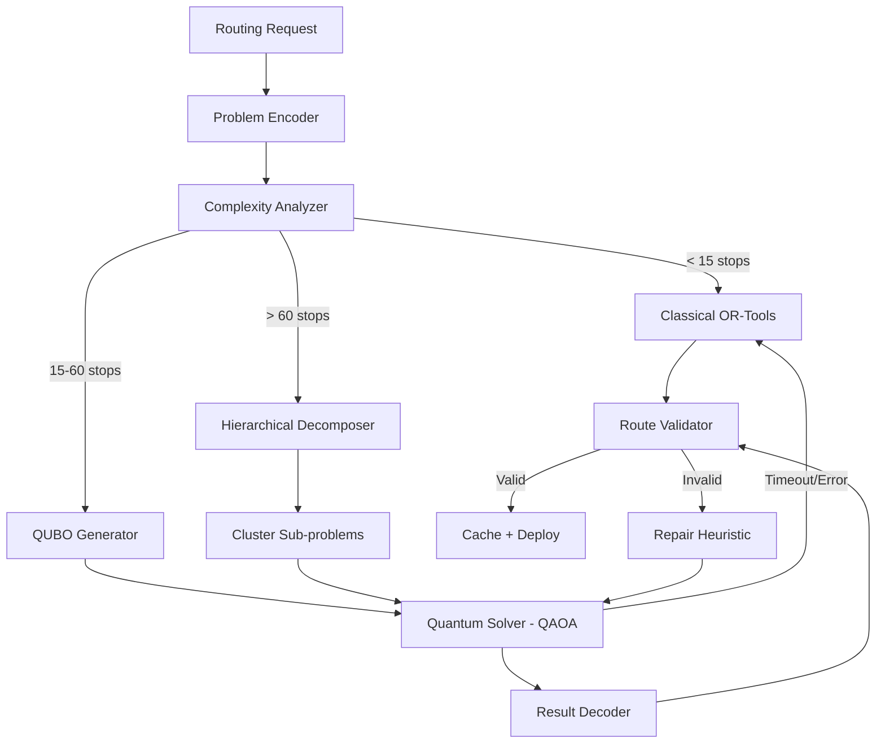

# 📄 TECH_STACK.md

**Product:** OmniRoute AI
**Purpose:** Define exact technology stack, versions, and architectural standards.
**Rule:** No vague tooling allowed. All dependencies version-locked.
**Last Updated:** 2026-02-27

---

# 1. Core Principles

- Single codebase → Web + Mobile (PWA + Capacitor)
- Edge-first architecture (CDN, edge functions)
- AI + Quantum Optimization native
- Horizontal scalability (stateless services)
- Microservice-ready with event-driven communication
- Vendor-neutral design (no cloud lock-in)
- Type-safe end-to-end (TypeScript + Pydantic)

---

# 2. Frontend Stack

## Framework

| Technology | Version | Purpose | Notes |
| --- | --- | --- | --- |
| **Node.js** | **22.x LTS** | Runtime | Latest LTS (Apr 2025) |
| **React** | **19.0.0** | UI library | Server Components, Actions, React Compiler |
| **Next.js** | **15.2.x** | Fullstack framework | Turbopack stable, async APIs |
| **TypeScript** | **5.7.x** | Type safety | Strict mode required |

> **Why React 19?** Server Components reduce client JS bundle, React Compiler automates memoization (no manual `useMemo`/`useCallback`), Actions API simplifies form mutations, `use()` hook for async data.

---

## UI & Rendering

| Tool | Version | Purpose |
| --- | --- | --- |
| React DOM | 19.0.0 | DOM rendering |
| TailwindCSS | 4.x | Utility CSS (v4: CSS-first config, native cascade layers) |
| PostCSS | 8.5.x | CSS processing |
| Autoprefixer | 10.4.x | Browser compat |

> **TailwindCSS 4** uses CSS-first configuration and native `@layer` — no `tailwind.config.js` file needed.

---

## Component System

| Tool | Version | Purpose |
| --- | --- | --- |
| shadcn/ui | latest (registry snapshot) | Pre-built accessible components |
| Radix UI Primitives | 1.1.x | Headless accessible primitives |
| Framer Motion | 12.x | Animation library |
| Lucide React | 0.470+ | Icon system |

---

## State Management

| Tool | Version | Purpose |
| --- | --- | --- |
| Zustand | 5.x | Client-side global state |
| TanStack Query | 5.x | Server state, caching, mutations |
| React 19 `useActionState` | built-in | Server action state management |
| React 19 `useOptimistic` | built-in | Optimistic UI updates |

> **Pattern:** Use TanStack Query for all server data. Use Zustand only for client-only state (UI preferences, map viewport). Use `useActionState` for form submissions.

---

## Maps & Visualization

| Tool | Version | Purpose |
| --- | --- | --- |
| Mapbox GL JS | 3.9.x | Primary map engine |
| deck.gl | 9.x | Large-scale data visualization layers |
| react-map-gl | 7.1.x | React wrapper for Mapbox |
| Recharts | 2.15.x | Dashboard charts |
| @visx/visx | 3.x | Custom data visualizations (fallback) |

---

## Forms & Validation

| Tool | Version | Purpose |
| --- | --- | --- |
| React Hook Form | 7.54.x | Form state management |
| Zod | 3.24.x | Schema validation (shared with backend via codegen) |

---

# 3. Mobile Strategy (Dynamic Serving)

Single frontend → mobile app via PWA + native wrapper.

| Tool | Version | Purpose |
| --- | --- | --- |
| Capacitor | 7.x | Native bridge (iOS/Android) |
| @capacitor/geolocation | 7.x | GPS access |
| @capacitor/push-notifications | 7.x | Push notifications |
| next-pwa / serwist | latest | Service Worker generation |
| Workbox | 7.3.x | Offline caching strategies |

### Offline Strategy (Driver Mode)

```
GPS updates queued in IndexedDB while offline
→ Sync to server on reconnection
→ Background sync via Service Worker
```

---

# 4. Backend Stack

## Core API Layer

| Technology | Version | Purpose |
| --- | --- | --- |
| Python | 3.13.x | Runtime |
| FastAPI | 0.115.x | Async API framework |
| Uvicorn | 0.34.x | ASGI server |
| Pydantic | 2.10.x | Data validation + settings |
| SQLAlchemy | 2.0.x | ORM (async mode) |
| Alembic | 1.14.x | Database migrations |
| asyncpg | 0.30.x | Async PostgreSQL driver |

---

## API Gateway

| Tool | Version | Purpose |
| --- | --- | --- |
| Strawberry GraphQL | 0.250.x | Python GraphQL server |
| Apollo Router | 2.x | Federation gateway (optional, for multi-service) |

> **REST endpoints** for simple CRUD operations. **GraphQL** for complex dashboard queries requiring flexible field selection across entities.

---

## Authentication

| Tool | Version | Purpose |
| --- | --- | --- |
| PyJWT | 2.10.x | JWT token creation/verification |
| passlib[bcrypt] | 1.7.x | Password hashing |
| python-multipart | 0.0.x | Form data parsing for auth endpoints |

**Auth flow:** JWT access token (15 min) + HTTP-only refresh token (7 days). Role-based middleware. Workspace-scoped permissions.

---

## Task Processing

| Tool | Version | Purpose |
| --- | --- | --- |
| ARQ | 0.26.x | Async task queue (Redis-backed) |
| Celery | 5.4.x | Alternative heavy-duty task queue |

> **Pattern:** Quantum jobs and batch analytics are offloaded to ARQ workers. API responses return immediately with job ID.

---

# 5. Optimization & Quantum Layer

## Classical Optimization

| Technology | Version | Purpose |
| --- | --- | --- |
| OR-Tools | 9.12.x | VRP, CVRP, VRPTW solver |
| NumPy | 2.2.x | Numerical computation |
| SciPy | 1.15.x | Scientific algorithms |
| NetworkX | 3.4.x | Graph algorithms |
| scikit-learn | 1.6.x | Clustering for hierarchical decomposition |

---

## Quantum Stack

| Technology | Version | Purpose |
| --- | --- | --- |
| **Qiskit** | **2.0.x** | Quantum SDK (major rewrite from 1.x) |
| qiskit-aer | 0.16.x | Local quantum simulator |
| qiskit-algorithms | 0.4.x | QAOA, VQE implementations |
| rustworkx | 0.16.x | High-performance graph algorithms (Qiskit dep) |
| PennyLane | 0.40.x | Vendor-neutral quantum ML (optional secondary) |

> [!WARNING]
> **Qiskit 2.x Migration:** Qiskit 1.x is deprecated. Key changes:
> - `qiskit.opflow` removed → use `qiskit.quantum_info`
> - `qiskit.utils.algorithm_globals` removed → use numpy random directly
> - `MinimumEigensolver` interface changed → use updated `qiskit-algorithms` 0.4+
> - `qiskit-optimization` package is being reworked — use QUBO builder manually

---

## ML / AI

| Tool | Version | Purpose |
| --- | --- | --- |
| PyTorch | 2.6.x | Neural network models |
| Transformers | 4.48.x | NLP for AI assistant |
| LangChain | 0.3.x | LLM orchestration |
| Sentence Transformers | 3.4.x | Embeddings for semantic search |

---

# 6. Realtime Infrastructure

| Tool | Version | Purpose |
| --- | --- | --- |
| Redis | 7.4.x | Cache, pub/sub, session store |
| Redis Streams | 7.4.x | Event streaming (lightweight Kafka alternative) |
| Apache Kafka | 3.9.x | Production event bus (high throughput) |
| WebSockets (native) | RFC 6455 | Real-time client communication |

> **Pattern:** Use **Redis Streams** for development and low-throughput production. Switch to **Kafka** only when event volume exceeds Redis capacity (~100k events/sec). Use native WebSockets via FastAPI, not Socket.IO.

> **Why not Socket.IO?** FastAPI has native WebSocket support. Socket.IO adds unnecessary abstraction, client library dependency, and protocol overhead. Native WebSockets are sufficient for GPS tracking and dashboard updates.

---

# 7. Database Layer

| Database | Version | Purpose |
| --- | --- | --- |
| PostgreSQL | 17.x | Primary relational DB |
| PostGIS | 3.5.x | Spatial queries, geography types |
| Redis | 7.4.x | Hot cache, rate limiting, sessions |
| Qdrant | 1.13.x | Vector DB for AI semantic search |

### Connection Pooling

| Tool | Version | Purpose |
| --- | --- | --- |
| PgBouncer | 1.23.x | PostgreSQL connection pooler |
| asyncpg pool | built-in | Async connection pool (app-level) |

> **Pattern:** PgBouncer in transaction mode for production. asyncpg built-in pool for development. Max 20 connections per service instance.

---

# 8. Storage

| Tool | Version | Purpose |
| --- | --- | --- |
| AWS S3 API | v2006-03-01 | Object storage interface |
| MinIO | latest | S3-compatible self-hosted storage (dev) |
| Cloudflare R2 | — | S3-compatible production storage (no egress fees) |

---

# 9. DevOps & Infrastructure

## Containerization

| Tool | Version |
| --- | --- |
| Docker | 27.x |
| Docker Compose | 2.32.x |

## Orchestration

| Tool | Version |
| --- | --- |
| Kubernetes | 1.32.x |
| Helm | 3.17.x |
| k3s | 1.32.x (lightweight alternative for single-node) |

## CI/CD

| Tool | Version | Purpose |
| --- | --- | --- |
| GitHub Actions | latest | CI/CD pipelines |
| Turborepo | 2.4.x | Monorepo build orchestration |
| Docker buildx | built-in | Multi-platform image builds |

---

## Observability

| Tool | Version | Purpose |
| --- | --- | --- |
| Prometheus | 2.56.x | Metrics collection |
| Grafana | 11.5.x | Dashboards + alerting |
| OpenTelemetry | 1.30.x | Distributed tracing |
| Loki | 3.3.x | Log aggregation |
| Pyroscope | 1.x | Continuous profiling (optional) |

---

# 10. Edge & Performance

| Tool | Version | Purpose |
| --- | --- | --- |
| Cloudflare | — | CDN, DDoS, edge caching |
| Vercel Edge Functions | compatible | Edge-deployed API routes (optional) |
| HTTP/3 + QUIC | enabled | Protocol optimization |
| Brotli compression | — | Response compression |

---

# 11. Security Stack

| Tool | Version | Purpose |
| --- | --- | --- |
| HTTPS | TLS 1.3 | Transport encryption |
| Helmet.js | 8.x | HTTP security headers (frontend) |
| Rate Limiting | Redis-backed (custom) | Per-user/tenant throttling |
| HashiCorp Vault | 1.18.x | Secrets management |
| Trivy | latest | Container vulnerability scanning |
| OWASP ZAP | latest | API security testing (CI) |

---

# 12. Testing Stack

| Tool | Version | Purpose |
| --- | --- | --- |
| Vitest | 3.x | Frontend unit tests (faster than Jest) |
| Playwright | 1.50.x | End-to-end browser tests |
| React Testing Library | 16.x | Component integration tests |
| Storybook | 8.5.x | Component documentation + visual testing |
| Pytest | 8.3.x | Backend unit/integration tests |
| pytest-asyncio | 0.25.x | Async test support |
| Hypothesis | 6.x | Property-based testing (edge cases) |
| k6 | latest | Load/performance testing |

---

# 13. Code Quality

| Tool | Version | Purpose |
| --- | --- | --- |
| ESLint | 9.x | JS/TS linting (flat config) |
| Prettier | 3.5.x | Code formatting |
| Ruff | 0.9.x | Python linting + formatting (replaces flake8, black, isort) |
| Pyright | latest | Python type checking |
| Husky | 9.x | Git hooks |
| Commitlint | 19.x | Conventional commit enforcement |
| lint-staged | 15.x | Run linters on staged files only |

---

# 14. Monorepo Structure

```
omniroute/
 ├── apps/
 │   ├── web/                    # Next.js 15 frontend
 │   └── mobile/                 # Capacitor wrapper
 ├── services/
 │   ├── api/                    # FastAPI core API
 │   ├── routing-engine/         # OR-Tools optimization
 │   ├── quantum-optimizer/      # Qiskit quantum service
 │   └── realtime/               # WebSocket + GPS tracking
 ├── packages/
 │   ├── ui/                     # Shared component library
 │   ├── config/                 # Shared ESLint, TSConfig, etc.
 │   ├── types/                  # Shared TypeScript types
 │   └── schemas/                # Shared Zod schemas (frontend ↔ backend)
 ├── infrastructure/
 │   ├── docker/                 # Dockerfiles per service
 │   ├── k8s/                    # Kubernetes manifests + Helm charts
 │   └── scripts/                # Setup, seed, migration scripts
 ├── experiences/                # Experience Engine mode packages
 │   ├── logistics/
 │   ├── emergency/
 │   ├── agriculture/
 │   ├── food/
 │   ├── smartcity/
 │   └── driver/
 ├── docs/                       # Documentation (this file lives here)
 └── .github/
     └── workflows/              # CI/CD pipelines
```

---

# 15. Browser Support

| Browser | Minimum Version |
| --- | --- |
| Chrome | ≥ 120 |
| Edge | ≥ 120 |
| Safari | ≥ 17.4 |
| Firefox | ≥ 125 |

> Safari 17.4+ required for full `@layer` support (TailwindCSS 4) and improved WebSocket stability.

---

# 16. Performance Targets

| Metric | Target | Tool |
| --- | --- | --- |
| First Contentful Paint | < 1.5s | Lighthouse |
| Largest Contentful Paint | < 2.5s | Web Vitals |
| Route Optimization (classical) | < 2s | Prometheus |
| Route Optimization (quantum sim) | < 30s | Prometheus |
| Map Render (1000 vehicles) | < 300ms | Performance API |
| API p50 Latency | < 50ms | Prometheus |
| API p99 Latency | < 200ms | Prometheus |
| WebSocket GPS Update | < 100ms round-trip | Custom metric |
| Bundle Size (initial) | < 200KB gzipped | Next.js build analyzer |

---

# 17. Upgrade Policy

| Type | Cadence | Process |
| --- | --- | --- |
| Security patches | Immediate | Dependabot auto-merge |
| Patch updates | Weekly | Auto-merge after CI passes |
| Minor updates | Monthly | Manual review + staging test |
| Major upgrades | Quarterly | Team review + migration plan |

---

# 🔬 18. Quantum Optimization Stack (Core Differentiator)

## Philosophy

Quantum computation is **not used for everything**. It is a targeted compute layer for problems where classical solvers hit exponential complexity.

**Quantum-eligible problems:**

- High-complexity routing (>20 stops, multi-constraint)
- Emergency prioritization (multi-objective optimization)
- Large fleet balancing (100+ vehicles)
- Traffic network simulation

**Architecture:**

```
Hybrid Quantum-Classical Optimization

Classical AI → prepares problem (clustering, distance matrix)
Quantum Solver → searches solution space (QAOA/VQE)
Classical System → validates & deploys route
```

---

## 18.1 Quantum Architecture Layer



---

## 18.2 Algorithms Used

### Primary: QAOA (Quantum Approximate Optimization Algorithm)

- Used for VRP, CVRP, emergency priority routing
- Layers: p=1 to p=5 (configurable)
- Classical optimizer: COBYLA (default), SPSA (noisy hardware)

### Secondary Algorithms

| Algorithm | Use Case |
| --- | --- |
| VQE (Variational Quantum Eigensolver) | Energy minimization mapping |
| Multi-Angle QAOA (MA-QAOA) | Improved solution quality |
| Hierarchical Quantum Optimization | Scale beyond hardware limits |
| Grover-inspired search | Route candidate filtering |

---

## 18.3 QUBO Problem Encoding

```
Stops → Binary Variables (x_ij = 1 if vehicle i visits stop j)
Distance → Cost Function (weighted adjacency matrix)
Constraints → Penalty Terms:
  - Each stop visited exactly once
  - Vehicle capacity not exceeded
  - Time windows respected
  - Start/end at depot

Objective:
  minimize: Σ(distance_ij · x_ij) + λ₁·capacity_penalty + λ₂·time_penalty
```

Penalty weights (λ) are **set per Experience Mode** — emergency uses high time penalty, logistics uses high distance penalty.

---

## 18.4 Execution Strategy

| Problem Size | Solver | Expected Time |
| --- | --- | --- |
| < 15 stops | Classical OR-Tools | < 1 second |
| 15–60 stops | Hybrid QAOA (simulator) | 5–30 seconds |
| > 60 stops | Hierarchical decomposition + QAOA | 30–120 seconds |

---

## 18.5 Quantum Service API

```
POST /quantum/optimize     → Submit optimization job
GET  /quantum/job/{id}     → Get job status + result
POST /quantum/simulate     → Smart city traffic simulation
GET  /quantum/health       → Service health + simulator status
```

---

## 18.6 Execution Modes

| Mode | Backend | Use Case |
| --- | --- | --- |
| Simulator | Qiskit Aer (local) | Development + CI tests |
| Cloud Quantum | IBM Quantum Runtime | Production batch jobs |
| Hybrid | Simulator fallback to cloud | Production default |

---

## 18.7 Safety Fallback (Production Critical)

```
Quantum Solver Start
     ↓
Timeout Check (30s default)
     ↓ (timeout exceeded)
Auto fallback → OR-Tools Solver
     ↓
Result returned (user never notices)
```

**Fallback triggers:**

- Quantum solver exceeds timeout
- IBM Quantum queue delay > 60 seconds
- Quantum result fails validation
- Quantum service health check fails

---

## 18.8 Caching Strategy

Quantum results cached (expensive computation):

```
Cache key: SHA-256(sorted_stops + constraints + weights)
Cache store: Redis
TTL: 6 hours (configurable per mode)
```

Cache hit rate target: > 40% in production (many routes repeat daily).

---

## 18.9 Compatibility Matrix

All quantum dependencies are tested together:

| Qiskit | qiskit-aer | qiskit-algorithms | Python | NumPy | Status |
| --- | --- | --- | --- | --- | --- |
| 2.0.x | 0.16.x | 0.4.x | 3.13.x | 2.2.x | ✅ Tested |
| 2.0.x | 0.16.x | 0.4.x | 3.12.x | 2.1.x | ✅ Compatible |

---

# 19. Deprecated / Do NOT Use

| Package | Reason | Replacement |
| --- | --- | --- |
| Qiskit 1.x | End of life | Qiskit 2.x |
| `qiskit.opflow` | Removed in Qiskit 2.x | `qiskit.quantum_info` |
| `qiskit.utils.algorithm_globals` | Removed | `numpy.random` directly |
| Socket.IO | Unnecessary abstraction | Native WebSocket |
| Jest | Slower than Vitest, complex config | Vitest |
| Black + isort + flake8 | Multiple tools | Ruff (single tool) |
| Create React App | Abandoned | Next.js |
| Moment.js | Large, mutable | date-fns or Temporal API |

---

# ✅ Stack Identity

This stack defines:

> **Hybrid Quantum-AI Routing Infrastructure Platform**
>
> Built on React 19 + Next.js 15 + FastAPI + Qiskit 2.x + PostgreSQL/PostGIS + Kubernetes

Type-safe end-to-end. Quantum-ready from day one. Production-grade.
